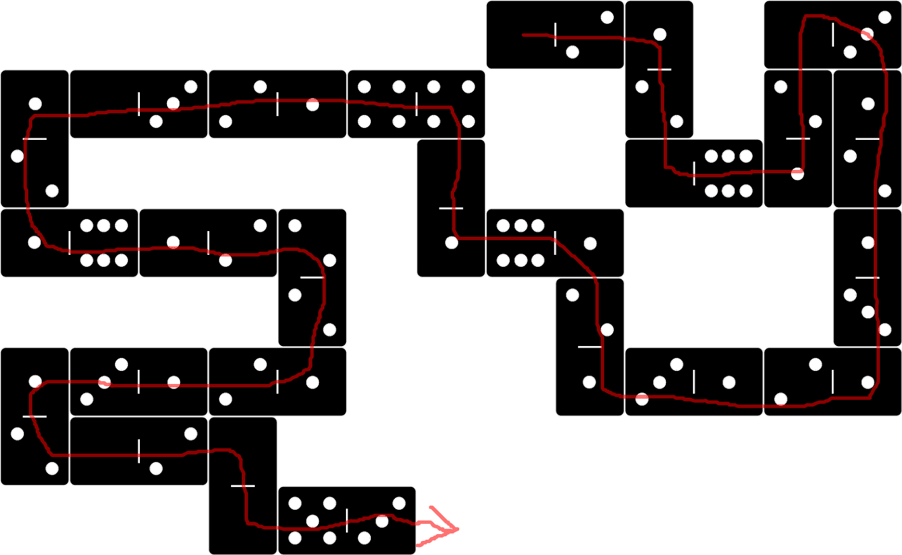

Example 003 - Hello World (direction changing)
=======================================



This is still just a hello world example, but this time the instruction pointer moves in multiple cardinal directions.

See [previous](002_hello_world_commented.md) example for a simpler version.

## Opcodes:
- [**STR**](../readme.md#str) `0—2`
- [**STROUT**](../readme.md#strout) `5—2`

## Pseudo code: 
```
STR "hello world" STROUT
```

## DominoScript:

<pre class="ds">
. . . . . . . . . . . . . . .
                             
. . . . . . . . 0—2 1 . 0—3 .
                    |        
. 1 0—3 2—1 4—4 . . 2 . 2 1 .
  |                     | |  
. 2 . . . . . 0 . . 0—6 1 2 .
              |              
. 1—6 1—2 2 . 1 6—1 . . . 1 .
          |               |  
. . . . . 2 . . . 2 . . . 3 .
                  |          
. 1 3—1 2—1 . . . 1 3—1 2—1 .
  |                          
. 2 0—2 0 . . . . . . . . . .
        |                    
. . . . 0 5—3 . . . . . . . .
</pre>


## Notes:


The IP always starts scanning the board from <ins>top-left to top-right and down</ins> until it finds the first non-empty cell *(In this case on the second code line the `0—1` is the first domino that is gonna be found)*.

In this particular example, the IP changes cardinal directions constantly but it mostly moves in the "forward" direction relative to the current direction it is facing.

Can you spot where it does move left or right instead of forward? There are two such places.
- Top-right corner it moves to the right
- Bottom-left corner it moves to the left

To learn more, take a look at [How navigation modes work](../readme.md#how-navigation-modes-work) it should be more clear afterwards.


Also see [how the Instruction Pointer Moves](../readme.md#how-the-instruction-pointer-moves). It will become crucial to understand where the IP will move when you have less gaps in the grid and dominos are side by side.

<style>
  .ds {position: relative;line-height: 1.2;letter-spacing: 3px;border: 1px solid gray;margin-bottom: 2.5rem;display: inline-block;}
</style>
