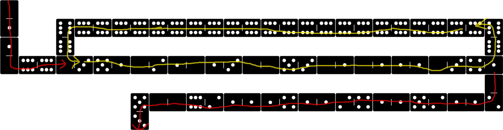

Example 004 - Loop Simple
=======================================

This shows a very simple way how to loop in DominoScript by moving back the instruction pointer to the start of the loop.

## Opcodes:
- [**NUM**](../readme.md#num) `0—1`
- [**STR**](../readme.md#str) `0—2`
- [**DUPE**](../readme.md#dupe) `0—3`
- [**SUB**](../readme.md#sub) `1—1`
- [**BRANCH**](../readme.md#branch) `4—1`
- [**NUMOUT**](../readme.md#numout) `5—1`
- [**STROUT**](../readme.md#strout) `5—3`
- [**NOOP**](../readme.md#noop) `6—6`

## Pseudocode:
Before the loop we push a number to the stack to act as index. Each iteration we print the index and decrement it. When the index reaches 0, the [BRANCH](../readme.md#branch) instruction will eventually break out of the loop.
- **NUM** `48`
- **<ins>LOOP_START</ins>**:
  - **DUPE**
  - **NUMOUT**
  - **STR** `'\n'` **STROUT**
  - **DUPE**
  - **NUM** `1`**SUB**
  - **DUPE**
  - **BRANCH**
    - true: **NOOP** until Instruction Pointer is back at **<ins>LOOP_START</ins>**
    - false: Continue after **<ins>LOOP_END</ins>**
- **<ins>LOOP_END</ins>**
- **STR** `'DONE'` **STROUT**

## DominoScript:

<pre class="ds">
. 0 . . . . . . . . . . . . . . . . . . . . . . . . . . .
  |                                                      
. 1 . . 6 6—6 6—6 6—6 6—6 6—6 6—6 6—6 6—6 6—6 6—6 6—6 6 .
        |                                             |  
. 1 . . 6 . . . . . . . . . . . . . . . . . . . . . . 6 .
  |                                                      
. 0 6—6 0—3 5—1 0—2 1—0 1—3 0—0 5—3 0—1 0—1 1—1 0—3 4—1 .
                                                         
. . . . . . . . . . . . . . . . . . . . . . . . . . . 0 .
                                                      |  
. . . . . . . . 5 0—0 6—2 1—1 1—4 1—1 2—4 1—1 5—2 1—1 2 .
                |                                        
. . . . . . . . 3 . . . . . . . . . . . . . . . . . . . .
</pre>

## Notes:

This way of looping can waste a few instruction cycles depending on how many NOOPs are executed to move the IP back to the start again.

You can obviously lay the dominos out in a way where the start and end are closer together, and avoid the need for NOOPs altogether BUT maybe you like placing sequences of dominos in a certain way and don't want to change that.

In that case, take a look at the [next example](005_loop_using_jump.md) that uses the JUMP instruction to move the IP back to the start instead of NOOPs.

