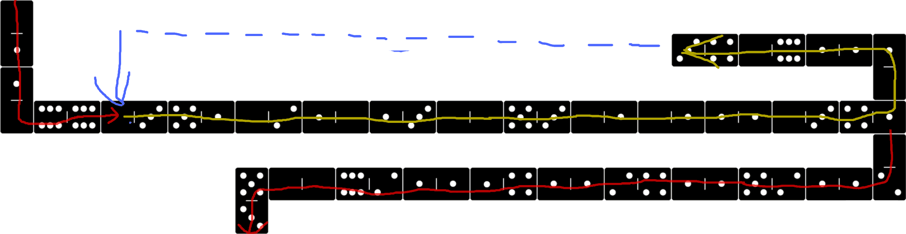

Example 005 - Loop using Jump
=======================================

This does pretty much the the same as the [previous example](004_loop_simple.md) but without wasting so many instruction cycles on NOOPs.

## Opcodes:
- [**NUM**](../readme.md#num) `0-1`
- [**STR**](../readme.md#str) `0-2`
- [**DUPE**](../readme.md#dupe) `0-3`
- [**SUB**](../readme.md#sub) `1-1`
- [**BRANCH**](../readme.md#branch) `4-1`
- [**JUMP**](../readme.md#jump) `4-3` <-------------- NEW
- [**NUMOUT**](../readme.md#numout) `5-1`
- [**STROUT**](../readme.md#strout) `5-3`
- [**NOOP**](../readme.md#noop) `6-6`

## Pseudocode:
Before the loop we push a number to the stack to act as index. Each iteration we print the index and decrement it. When the index reaches 0, the [BRANCH](../readme.md#branch) instruction will eventually break out of the loop. Only difference with last example is that we use JUMP instead of NOOPing back to the start.

- **PUSH** `48` (index)
- **<ins>LOOP_START</ins>**:
  - **DUPE**
  - **NUMOUT**
  - **PUSH** `'\n'`
  - **STROUT**
  - **DUPE**
  - **PUSH** `1`
  - **SUB**
  - **DUPE**
  - **BRANCH**
    - true: push address `91` (Address of **<ins>LOOP_START</ins>**) and **JUMP** to it <-------------- NEW
    - false: Continue after **<ins>LOOP_END</ins>**
- **<ins>LOOP_END</ins>**
- **PUSH** `'DONE'`
- **STROUT**

## DominoScript:

<pre class="ds">
. 0 . . . . . . . . . . . . . . . . . . . . . . . . . . .
  |                                                      
. 1 . . . . . . . . . . . . . . . . . . . 3—4 0—6 1—1 1 .
                                                      |  
. 1 . . . . . . . . . . . . . . . . . . . . . . . . . 0 .
  |                                                      
. 0 6—6 0—3 5—1 0—2 1—0 1—3 0—0 5—3 0—1 0—1 1—1 0—3 4—1 .
                                                         
. . . . . . . . . . . . . . . . . . . . . . . . . . . 0 .
                                                      |  
. . . . . . . . 5 0—0 6—2 1—1 1—4 1—1 2—4 1—1 5—2 1—1 2 .
                |                                        
. . . . . . . . 3 . . . . . . . . . . . . . . . . . . . .
</pre>

## Notes:

The JUMP instruction works with both direct addressing and labels. See [next example](006_loop_using_jump_and_label.md) for how to use labels.

