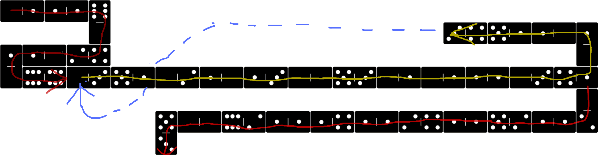

Example 006 - Loop using Jump and Label
=======================================

This does pretty much the the same as the previous two examples: [example 004](004_loop_simple.md) and [example 005](005_loop_using_jump.md) but it uses both labels and jumps to iterate.

## Opcodes:
- [**NUM**](../readme.md#num) `0—1`
- [**STR**](../readme.md#str) `0—2`
- [**DUPE**](../readme.md#dupe) `0—3`
- [**SUB**](../readme.md#sub) `1—1`
- [**NEG**](../readme.md#neg) `1—5` <-------------- NEW
- [**BRANCH**](../readme.md#branch) `4—1`
- [**LABEL**](../readme.md#label) `4—2` <-------------- NEW
- [**JUMP**](../readme.md#jump) `4—3`
- [**NUMOUT**](../readme.md#numout) `5—1`
- [**STROUT**](../readme.md#strout) `5—3`
- [**NOOP**](../readme.md#noop) `6—6`

## Pseudocode:
Within the loop we do exactly the same as in the previous examples. The difference here is that we use a label instead of a direct address to jump back to the start of the loop.

- **NUM** `91` **LABEL** (The label is `-1`. Read why [here](../readme.md#labels)) <-------------- NEW
- **NUM** `48` (index)
- **<ins>LOOP_START</ins>**: (address: `91`)
  - **DUPE**
  - **NUMOUT**
  - **STR** `'\n'` **STROUT**
  - **DUPE**
  - **NUM** `1` **SUB**
  - **DUPE**
  - **BRANCH**
    - true: jump back to label `-1` <-------------- NEW
    - false: Continue after **<ins>LOOP_END</ins>**
- **<ins>LOOP_END</ins>**
- **STR** `'DONE'` **STROUT**

## DominoScript:

<pre class="ds">
. 0—1 1—1 6 . . . . . . . . . . . . . . . . . . . . . . .
          |                                              
. . . . . 0 . . . . . . . . . . . . . . . 3—4 5—1 1—0 1 .
                                                      |  
. 1 1—0 2—4 . . . . . . . . . . . . . . . . . . . . . 0 .
  |                                                      
. 0 6—6 0—3 5—1 0—2 1—0 1—3 0—0 5—3 0—1 0—1 1—1 0—3 4—1 .
                                                         
. . . . . . . . . . . . . . . . . . . . . . . . . . . 0 .
                                                      |  
. . . . . . . . 5 0—0 6—2 1—1 1—4 1—1 2—4 1—1 5—2 1—1 2 .
                |                                        
. . . . . . . . 3 . . . . . . . . . . . . . . . . . . . .
</pre>

## Notes:

The `JUMP` is not the only instruction that can use labels. `CALL`, `GET` and `SET` can also make use of them. Basically any instruction that requires an address can also use a label instead.

