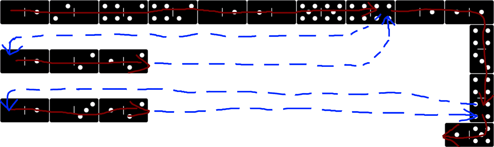

Example 007 - Calling functions by Address
=======================================



With both `CALL` and `JUMP` you can move the Instruction Pointer to a specific domino on the grid but what makes `CALL` different is that it will remember from where it was called from and return to that position after it cannot move anymore.

This example shows how to call functions by address.
 
## Opcodes:
- [**NUM**](../readme.md#num) `0—1`
- [**MULT**](../readme.md#mult) `1—2`
- [**CALL**](../readme.md#call) `4—4`
- [**NUMOUT**](../readme.md#numout) `5—1`

## Pseudocode:
We define functions that double and triple the number on top of the stack. Then we call them by address and print the result. which should be 9000.

```js
NUM 1500
NUM 40 CALL
NUM 80 CALL
NUMOUT

FUNCTION DOUBLE: // (address 40)
  NUM 2
  MUL

FUNCTION TRIPLE: // (address 80)
  NUM 3
  MUL
```


## DominoScript:

```
0—1 2—0 4—2 4—2 0—1 1—0 5—5 4—4 0—1 1—1
                                       
. . . . . . . . . . . . . . . . . . . 4
                                      |
0—1 0—2 1—2 . . . . . . . . . . . . . 3
                                       
. . . . . . . . . . . . . . . . . . . 4
                                      |
0—1 0—3 1—2 . . . . . . . . . . . . . 4
                                       
. . . . . . . . . . . . . . . . . . 1—5
```

## Notes:
It is important to know the grid size to know the address of the functions. Here it is 20 cells wide and 6 cells tall.

The first line that wraps down on the right is the main code. The rest of the code are the "functions".
- `DOUBLE` at address 40
- `TRIPle` at address 80

At no point in the code do we actually "define" a function. A function in DS is really just a sequence of dominos on the board that you can jump to directly via address or using a label.

> A `CALL` is just a jump with implicit jump back once IP cannot move anymore.

See [next example](008_calling_functions_by_label.md) to see how to call functions by label.
