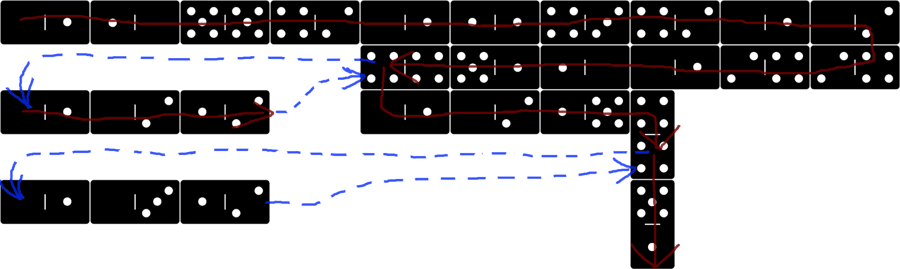

Example 008 - Calling functions by Label
=======================================



Same as the [previous example](007_calling_functions_by_address.md) but we use labels instead of addresses to call functions.

 
## Opcodes:
- [**NUM**](../readme.md#num) `0—1`
- [**MULT**](../readme.md#mult) `1—2`
- [**NEG**](../readme.md#neg) `1—5` <-------------- NEW
- [**LABEL**](../readme.md#label) `4—2` <-------------- NEW
- [**CALL**](../readme.md#call) `4—4`
- [**NUMOUT**](../readme.md#numout) `5—1`

## Pseudocode:
We map addresses 40 and 80 to labels -1 and -2 respectively.

We define functions that double and triple the number on top of the stack. Then we call them by label and print the result. which should be `9000`.

```js
NUM 40 LABEL
NUM 80 LABEL
NUM 1500
NUM 1 NEG CALL
NUM 2 NEG CALL
NUMOUT

FUNCTION DOUBLE: // (address 40, label -1)
  NUM 2
  MUL

FUNCTION TRIPLE: // (address 80, label -2)
  NUM 3
  MUL
```


## DominoScript:

```
0—1 1—0 5—5 4—2 0—1 1—1 4—3 4—2 0—1 2—0
                                       
. . . . . . . . 4—4 5—1 1—0 1—0 2—4 2—4
                                       
0—1 0—2 1—2 . . 0—1 0—2 1—5 4 . . . . .
                            |          
. . . . . . . . . . . . . . 4 . . . . .
                                       
0—1 0—3 1—2 . . . . . . . . 5 . . . . .
                            |          
. . . . . . . . . . . . . . 1 . . . . .
```

## Notes:
You can call functions wither by label or by address. Labels are resolved to addresses before being pushed to the return stack.

- `DOUBLE` labeled -1. Resolves to address 40
- `TRIPle` labeled -2. Resolves to address 80

<br>

See the [factorial example](009_recursive_factorial.md) for recursive function calls.
