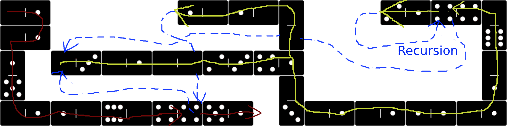

Example 009 - Factorial Recursion
=======================================


 
## Opcodes:
- [**POP**](../readme.md#pop) `0—0`
- [**NUM**](../readme.md#num) `0—1`
- [**DUPE**](../readme.md#dupe) `0—3`
- [**SUB**](../readme.md#sub) `1—1`
- [**MULT**](../readme.md#mult) `1—2`
- [**NEG**](../readme.md#neg) `1—5`
- [**EQL**](../readme.md#eql) `2—3`
- [**BRANCH**](../readme.md#branch) `4—1`
- [**LABEL**](../readme.md#label) `4—2`
- [**CALL**](../readme.md#call) `4—4`
- [**NUMOUT**](../readme.md#numout) `5—1`

## Pseudocode:
We define a recursive function that calculates the factorial of a number. We call it with 12 and print the result, which should be `479001600`

```
NUM 12
NUM 42 CALL
NUMOUT

FUNCTION FACTORIAL (address 42)
  DUP NUM 0 EQ
  IF
    POP
    NUM 1
  ELSE
    DUP NUM 1 SUB
    NUM 42 CALL 
    MUL
  END
END
```

## DominoScript:

<pre class="ds">
0—1 . . . . . 1—0 1—0 0 . . . 2—1 4—4 0
                      |               |
0—1 . . . . . . . . . 0 . . . . . . . 6
                                       
1 . 0—3 0—1 0—0 2—3 4—1 . . . . . . . 0
|                                     |
5 . . . . . . . . . . 0 . . . . . . . 1
                      |                
0—1 1—0 6—0 4—4 5—1 . 3 0—1 0—1 1—1 0—1
</pre>

## Notes:
Internally DominoScript maintains a return stack containing the int32 address to return to. The size is limited and preallocated in advance *(maybe uint32 since addresses are all positive and labels are resolved to addresses before pushed to return stack)*

You can perform recursive calls but only up to a limited depth *(Not sure yet what the max depth will be by default, but for now assume 512 as max. Might be configurable.)*

> *Also note that the result of `factorial(12)` is the largest one that fits in an int32 without overflowing. `Factorial(13)` would overflow and return a number that is not the factorial of 13 but ---> 1932053504 - If you create your own implementation of DominoScript, keep that in mind*

<style>
  .ds {position: relative;line-height: 1.2;letter-spacing: 3px;border: 1px solid gray;margin-bottom: 2.5rem;display: inline-block;}
</style>
