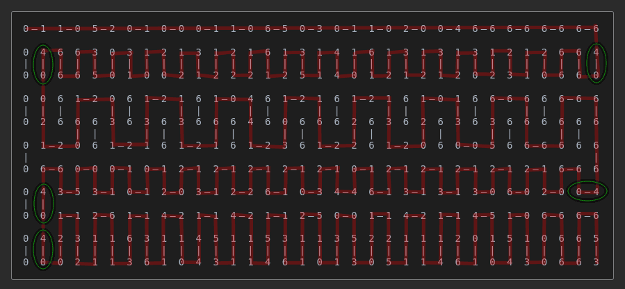

Example 010 - Navigation Mode Changes
=======================================



This example demonstrates how navigation modes affect the Instruction Pointer movement.

Changing the navigation mode can help you get to where you want to go when dominos are mushed together.
 
## Opcodes:
- [**STR**](../readme.md#str) `0—2`
- [**DUPE**](../readme.md#dupe) `0—3`
- [**SWAP**](../readme.md#swap) `0—4`
- [**NAVM**](../readme.md#navm) `4—0`*(used to change navigation mode, see green circles)* 
- [**STROUT**](../readme.md#strout) `5—3`
- [**NOOP**](../readme.md#noop) `6—6`

## Pseudocode:
```js
// We push most nav mode indices ahead of time.
NUM 37 // 5-2
NUM 0  // 0-0
NUM 47 // 6-5
DUP
NUM 14 // 2-0
SWAP 

// Stack is now: [37, 0, 47, 14, 47]

NAVM // mode 47 - FlipFlop: right and left
STR "Hello World\n" STROUT
NAVM // mode 14 - Basic: Forward
STR "hello world\n" STROUT
NAVM // mode 47 - FlipFlop: right and left
STR "hello world\n" STROUT
NAVM // mode 0  - Basic: Forward, left, right (Just to move 1 cell fwd)
NAVM // mode 37 - Cycle: left, forward, right
STR "HELLO WORLD\n" STROUT
STR "DONE!!\n" STROUT
```

## DominoScript:

```
0—1 1—0 5—2 0—1 0—0 0—1 1—0 6—5 0—3 0—1 1—0 2—0 0—4 6—6 6—6 6—6 6—6
                                                                   
0 4 6 6 3 0 3 1 2 1 3 1 2 1 6 1 3 1 4 1 6 1 3 1 3 1 3 1 2 1 2 6 6 4
| | | | | | | | | | | | | | | | | | | | | | | | | | | | | | | | | |
0 0 6 6 5 0 1 0 0 2 1 2 2 2 1 2 5 1 4 0 1 2 1 2 1 2 0 2 3 1 0 6 6 0
                                                                   
0 0 6 1—2 0 6 1—2 1 6 1—0 4 6 1—2 1 6 1—2 1 6 1—0 1 6 6—6 6 6 6—6 6
| | |     | |     | |     | |     | |     | |     | |     | |     |
0 2 6 6 6 3 6 3 6 3 6 6 6 4 6 0 6 6 6 2 6 3 6 2 6 3 6 3 6 6 6 6 6 6
      | |     | |     | |     | |     | |     | |     | |     | |  
0 1—2 0 6 1—2 1 6 1—2 1 6 1—2 3 6 1—2 2 6 1—2 0 6 0—0 5 6 6—6 6 6 6
|                                                                 |
0 6—6 0—0 0—1 0—1 2—1 2—1 2—1 2—1 2—1 0—1 2—1 2—1 2—1 2—1 2—1 6—6 6
                                                                   
0 4 3—5 3—1 0—1 2—0 3—1 2—2 6—1 0—3 4—4 6—1 3—1 3—1 3—0 6—0 2—0 0—4
| |                                                                
0 0 1—1 2—6 1—1 4—2 1—1 4—2 1—1 2—5 0—0 1—1 4—2 1—1 4—5 1—0 6—6 6—6
                                                                   
0 4 2 3 1 1 6 3 1 1 4 5 1 1 5 3 1 1 3 5 2 2 1 1 1 2 0 1 5 1 0 6 6 5
| | | | | | | | | | | | | | | | | | | | | | | | | | | | | | | | | |
0 0 0 2 1 1 3 6 1 0 4 3 1 1 4 6 1 0 1 3 0 5 1 1 4 6 1 0 4 3 0 6 6 3
```

## Notes:

You can see repeating patterns in how dominos are laid out here. That doesn't necessarily have to be the case. Nav modes can help you get out of a pickle when you need to move into a specific direction but don't have the necessary space to do so without having to move dominos around.


See [how navigation modes work](../readme.md#how-navigation-modes-work) for more information.
