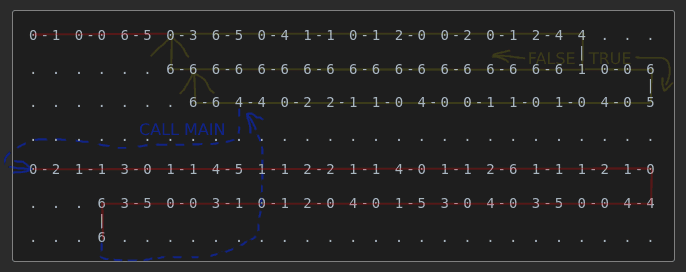

Example 011 - Basic Game Loop
=======================================



This shows how to use the `TIME` instruction to create a simple game loop that runs 10 times per second and prints the frame count to the console.
 
## Opcodes:
- [**POP**](../readme.md#pop) `0—0`
- [**NUM**](../readme.md#num) `0—1`
- [**STR**](../readme.md#str) `0—2`
- [**DUPE**](../readme.md#dupe) `0—3`
- [**SWAP**](../readme.md#swap) `0—4`
- [**ADD**](../readme.md#add) `1—0`
- [**SUB**](../readme.md#sub) `1—1`
- [**GTR**](../readme.md#gtr) `2—4`
- [**BRANCH**](../readme.md#branch) `4—1`
- [**CALL**](../readme.md#call) `4—4`
- [**NUMOUT**](../readme.md#numout) `5—1`
- [**STROUT**](../readme.md#strout) `5—3`
- [**TIME**](../readme.md#time) `6—5`
- [**NOOP**](../readme.md#noop) `6—6`

## Pseudocode:

```js
NUM 6
TIME

LOOP_FOREVER:
  DUPE TIME SWAP SUB
  NUM 99 GTR
  IF:
    POP
    TIME
    SWAP
    NUM 1
    ADD
    NUM 112 CALL
  ELSE:
    NOOP

FUNCTION MAIN: // address: 112
  STR "Frame: " STROUT
  SWAP DUPE NUMOUT SWAP
  STR "\n" STROUT
```

It is more or less the equivalent of the following JavaScript code:

```js
let frame = 0;
let time = Date.now();

while(true) {
  const diff = Date.now() - time;
  if (diff > 99) {
    time = Date.now();
    frame++;
    main();
  }
}

function main() {
  console.log('Frame:', frame);
}
```

## DominoScript:

```
0—1 0—0 6—5 0—3 6—5 0—4 1—1 0—1 2—0 0—5 0—1 2—4 4 . . .
                                                |      
. . . . . . 6—6 6—6 6—6 6—6 6—6 6—6 6—6 6—6 6—6 1 0—0 6
                                                      |
. . . . . . . 6—6 4—4 0—2 2—1 1—0 4—0 0—1 1—0 1—0 4—0 5
                                                       
. . . . . . . . . . . . . . . . . . . . . . . . . . . .
                                                       
0—2 1—1 3—0 1—1 4—5 1—1 2—2 1—1 4—0 1—1 2—6 1—1 1—2 1—0
                                                       
. . . 6 3—5 0—0 3—1 0—1 2—0 4—0 1—5 3—0 4—0 3—5 0—0 4—4
      |                                                
. . . 6 . . . . . . . . . . . . . . . . . . . . . . . .
```

## Notes:
This is kept minimal to show the concept. Future examples will expand on this. TODO
