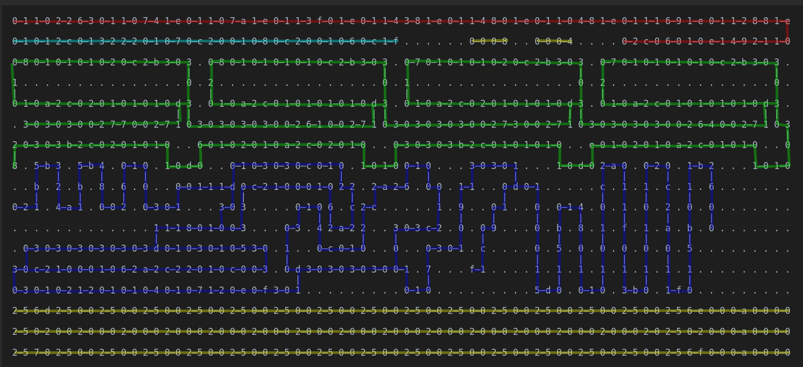

Example 023 - WASD Controls
=====================================




This example demonstrates `WASD` input controls that moves a character around the screen.
It could be used as a basis to build a simple game.

## Opcodes:
*(domino mappings are shown in base 16)*
- [**NUM**](../readme.md#num) `0—1`
- [**STR**](../readme.md#str) `0—2`
- [**DUPE**](../readme.md#dupe) `0—3`
- [**ADD**](../readme.md#add) `0—7`
- [**SUB**](../readme.md#sub) `0—8`
- [**NEG**](../readme.md#neg) `0—c`s
- [**CLAMP**](../readme.md#clamp) `0—d`
- [**NOT**](../readme.md#not) `0—e`
- [**AND**](../readme.md#and) `0—f`
- [**EQL**](../readme.md#eql) `1—1`
- [**GTR**](../readme.md#gtr) `1—2`
- [**BRANCH**](../readme.md#branch) `1—d`
- [**LABEL**](../readme.md#label) `1—e`
- [**JUMP**](../readme.md#jump) `1—f`
- [**CALL**](../readme.md#call) `2—0`
- [**WAIT**](../readme.md#wait) `2—2`
- [**NUMOUT**](../readme.md#numout) `2—4`
- [**STROUT**](../readme.md#strout) `2—6`
- [**KEY**](../readme.md#key) `2—7`
- [**KEYRES**](../readme.md#keyres) `2—8`
- [**GET**](../readme.md#get) `2—a`
- [**SET**](../readme.md#set) `2—b`
- [**LIT**](../readme.md#lit) `2—c`
- [**NOOP**](../readme.md#noop) `3—0`
 
## Pseudo code:
Roughly equivalent to the following JavaScript code:
 ```js
 const sizeX = 14;
 const sizeY = 8;
 let x = sizeX / 2;
 let y = sizeY / 2;

 const topRow = '╭' + '─'.repeat(sizeX) + '╮\n';
 const midRow = '│' + ' '.repeat(sizeX) + '│\n';
 const botRow = '╰' + '─'.repeat(sizeX) + '╯\n';

 async function main() {
  while (true) {
     await WAIT(100);
     update();
     render();
   }
 }
 
 function update() {
   if (KEY('w')) y = y - 1;
   if (KEY('a')) x = x - 2;
   if (KEY('s')) y = y + 1;
   if (KEY('d')) x = x + 2;
   x = CLAMP(x, 2, sizeX);
   y = CLAMP(y, 2, sizeY);
   KEYRES();
 }
 
 function render() {
   stdout.write('\033[2J\033[H'); // <--- ANSI sequence to clear screen and move cursor to top left

  for (let i = 0; i <= sizeY; i++) {
    if (i === 0) stdout.write(topRow);
    if (i === sizeY) stdout.write(botRow);
    if (i > 0 && i < sizeY) stdout.write(midRow);
    
    stdout.write(`\033[${y};${x}H[ ]`); // move cursor to XY and draw "player" using "[ ]"
   }
 }
```

This pseudocode represents the DominoScript almost 1:1.

```js
NUM 16 BASE // tell interpreter to use dominos with up to 16 dots per side. Allowing you to use less dominos

// Binding addresses to labels
NUM 116 LABEL // playerX                              -1
NUM 122 LABEL // playerY                              -2
NUM 1008 LABEL // topRow     = "╭──────────────╮\n"   -3
NUM 1080 LABEL // middleRow  = "│              │\n"   -4
NUM 1152 LABEL // bottomRow  = "╰──────────────╯\n"   -5
NUM 72 LABEL  // function main()                      -6
NUM 361 LABEL // function update()                    -7
NUM 505 LABEL // function render()                    -8
NUM 660 LABEL // loop body start within render()      -9

NUM 6 NEG CALL // main()

FUNCTION main:
  NUM 1 LIT // tell interpreter that we use exactly 1 domino for each number or character in a string
  LOOP_FOREVER:
    NUM 50 WAIT // wait 50ms
    PUSH 7 NEG CALL // update()
    PUSH 8 NEG CALL // render()
    NUM 6 NEG JUMP // jump back to start of main


FUNCTION update:
  STR "w" KEY IF:
    NUM 1 NUM 2 NEG GET NUM 1 SUB NUM 1 NUM 2 NEG SET // y = y - 1  
  STR "a" KEY IF:
    NUM 1 NUM 1 NEG GET NUM 2 SUB NUM 1 NUM 1 NEG SET // x = x - 2
  STR "s" KEY IF:
    NUM 1 NUM 2 NEG GET NUM 1 ADD NUM 1 NUM 2 NEG SET // y = y + 1
  STR "d" KEY IF:
    NUM 1 NUM 1 NEG GET NUM 2 ADD NUM 1 NUM 1 NEG SET // x = x + 2

  NUM 1 NUM 1 NEG GET NUM 2 NUM 13 CLAMP NUM 1 NUM 1 NEG SET // x = clamp(x, 2, 13)
  NUM 1 NUM 2 NEG GET NUM 2 NUM 6 CLAMP NUM 1 NUM 2 NEG SET // y = clamp(y, 2, 6)
  KEYRES


FUNCTION render:
  STR '\033[2J\033[H' STDOUT // clear screen and move cursor to top left
  NUM 0 // iterator = 0;

  LOOP:
    DUPE NUM 0 EQL IF: // if (iterator === 0)
      NUM 3 NUM 3 NEG NUM 2 LIT GET STROUT NUM 1 LIT // render Top row string if on row 0

    DUPE NUM 8 EQL IF: // if (iterator === 8)
      NUM 3 NUM 5 NEG NUM 2 LIT GET STROUT NUM 1 LIT // render Bottom row string if on row 8
    
    DUPE DUPE NUM 2 GTR NUM 1 ROLL NUM 7 GTR NOT AND IF: // if (iterator > 2 && iterator < 7)
      NUM 3 NUM 4 NEG NUM 2 LIT GET STROUT NUM 1 LIT // render Middle row string if on row 1-7

    NUM 1 ADD // iterator = iterator + 1

    DUPE NUM 8 EQL IF:
      // Hacky way to achieve the equivalent of: stdout.write(`\033[${playerY};${playerX}H[]`)
      // The string is constructed 1 char at a time in reverse order using NUM
      NUM 0 NUM 93 NUM 91 NUM 72 NUM 1 NUM 1 NEG GET NUM 31 NUM 59 NUM 1 NUM 2 NEG GET NUM 31 NUM 91 NUM 27 STROUT
      POP // remove iterator from stack
      BREAK // exit loop if we've reached the bottom row

    NUM 9 NEG JUMP // jump back to start of loop
```

## DominoScript:
```
0—1 1—0 2—2 6—3 0—1 1—0 7—4 1—e 0—1 1—0 7—a 1—e 0—1 1—3 f—0 1—e 0—1 1—4 3—8 1—e 0—1 1—4 8—0 1—e 0—1 1—0 4—8 1—e 0—1 1—1 6—9 1—e 0—1 1—2 8—8 1—e
                                                                                                                                               
0—1 0—1 2—c 0—1 3—2 2—2 0—1 0—7 0—c 2—0 0—1 0—8 0—c 2—0 0—1 0—6 0—c 1—f . . . . . . 0—0 0—8 . . 0—0 0—4 . . . . 0—2 c—0 6—0 1—0 e—1 4—9 2—1 1—0
                                                                                                                                               
0—8 0—1 0—1 0—1 0—2 0—c 2—b 3—0 3 . 0—8 0—1 0—1 0—1 0—1 0—c 2—b 3—0 3 . 0—7 0—1 0—1 0—1 0—2 0—c 2—b 3—0 3 . 0—7 0—1 0—1 0—1 0—1 0—c 2—b 3—0 3 .
                                |                                   |                                   |                                   |  
1 . . . . . . . . . . . . . . . 0 . 2 . . . . . . . . . . . . . . . 0 . 1 . . . . . . . . . . . . . . . 0 . 2 . . . . . . . . . . . . . . . 0 .
|                                   |                                   |                                   |                                  
0 1—0 a—2 c—0 2—0 1—0 1—0 1—0 d 3 . 0 1—0 a—2 c—0 1—0 1—0 1—0 1—0 d 3 . 0 1—0 a—2 c—0 2—0 1—0 1—0 1—0 d 3 . 0 1—0 a—2 c—0 1—0 1—0 1—0 1—0 d 3 .
                              | |                                 | |                                 | |                                 | |  
. 3—0 3—0 3—0 0—2 7—7 0—0 2—7 1 0 3—0 3—0 3—0 3—0 0—2 6—1 0—0 2—7 1 0 3—0 3—0 3—0 3—0 0—2 7—3 0—0 2—7 1 0 3—0 3—0 3—0 3—0 0—2 6—4 0—0 2—7 1 0 3
                                                                                                                                              |
2 0—3 0—3 b—2 c—0 2—0 1—0 1—0 . . 6—0 1—0 2—0 1—0 a—2 c—0 2—0 1—0 . . 0—3 0—3 0—3 b—2 c—0 1—0 1—0 1—0 . . e—0 1—0 2—0 1—0 a—2 c—0 1—0 1—0 . . 0
|                                                                                                                                              
8 . 5—b 3 . 5—b 4 . 0—1 0 . 1—0 d—0 . . 0—1 0—3 0—3 0—c 0—1 0 . 1—0 1—0 0—1 0 . . . 3—0 3—0 1 . . . 1—0 d—0 2—a 0 . 0—2 0 . 1—b 2 . . . 1—0 1—0
        |       |       |                                   |               |               |                   |       |       |              
. . b . 2 . b . 8 . 6 . 0 . . 0—0 1—1 1—d 0 c—2 1—0 0—0 1—0 2 2 . 2—a 2—6 . 0 0 . 1—1 . . 0 d 0—1 . . . . . c . 1 . 1 . c . 1 . 6 . . . . . . .
    |       |       |                     |                   |               |           |                 |       |       |                  
0—2 1 . 4—a 1 . 0—0 2 . 0—3 0—1 . . . 3—0 3 . . . . 0—1 0 6 . c 2—c . . . . . 1 . 9 . . 0 1 . . 0 . 0—1 4 . 0 . 1 . 0 . 2 . 0 . 0 . . . . . . .
                                                        | |                       |     |       |       |       |       |       |              
. . . . . . . . . . . . . 1 1—1 8—0 1—0 0—3 . . . 0—3 . 4 2 a—2 2 . . 3 0—3 c—2 . 0 . 0 9 . . . 0 . b . 8 . 1 . f . 1 . a . b . 0 . . . . . . .
                          |                                     |     |               |             |       |       |       |                  
. 0—3 0—3 0—3 0—3 0—3 0—3 d 0—1 0—3 0—1 0—5 3—0 . 1 . . 0—c 0—1 0 . . 0 . . 0—3 0—1 . c . . . . 0 . 5 . 0 . 0 . 0 . 0 . 0 . 5 . . . . . . . . .
                                                  |                                             |       |       |       |                      
3—0 c—2 1—0 0—0 1—0 6—2 a—2 c—2 2—0 1—0 c—0 0—3 . 0 d 3—0 3—0 3—0 3—0 0—1 . 7 . . . f—1 . . . . 1 . 1 . 1 . 1 . 1 . 1 . 1 . 1 . . . . . . . . .
                                                    |                       |                       |       |       |       |                  
0—3 0—1 0—2 1—2 0—1 0—1 0—4 0—1 0—7 1—2 0—e 0—f 3—0 1 . . . . . . . . . 0—1 0 . . . . . . . . . 5—d 0 . 0—1 0 . 3—b 0 . 1—f 0 . . . . . . . . .
                                                                                                                                               
2—5 6—d 2—5 0—0 2—5 0—0 2—5 0—0 2—5 0—0 2—5 0—0 2—5 0—0 2—5 0—0 2—5 0—0 2—5 0—0 2—5 0—0 2—5 0—0 2—5 0—0 2—5 0—0 2—5 0—0 2—5 6—e 0—0 0—a 0—0 0—0
                                                                                                                                               
2—5 0—2 0—0 2—0 0—0 2—0 0—0 2—0 0—0 2—0 0—0 2—0 0—0 2—0 0—0 2—0 0—0 2—0 0—0 2—0 0—0 2—0 0—0 2—0 0—0 2—0 0—0 2—0 0—0 2—0 2—5 0—2 0—0 0—a 0—0 0—0
                                                                                                                                               
2—5 7—0 2—5 0—0 2—5 0—0 2—5 0—0 2—5 0—0 2—5 0—0 2—5 0—0 2—5 0—0 2—5 0—0 2—5 0—0 2—5 0—0 2—5 0—0 2—5 0—0 2—5 0—0 2—5 0—0 2—5 6—f 0—0 0—a 0—0 0—0
```

## Notes:
<ins>**Why do we use labels instead of hardcoding the addresses?**</ins> - Up to the developer. You can reduce the amount of dominos if you don't use labels. Labels are  only mandatory to be able to reference functions and data from imported scripts. One benefit of labels is that you only need to change the referenced address in one place when you move stuff around or resize the grid.
