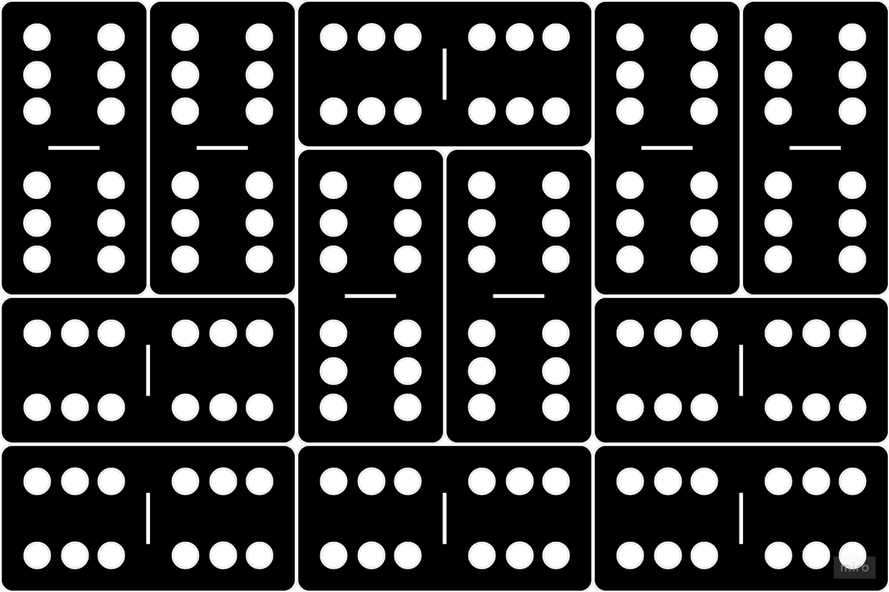

DominoScript
================================================================================

**Current version `0.0.4`**

Have you ever wanted to write code using domino pieces? No?

Well, now you can! Introducing DominoScript!

> A recreational stack-oriented concatenative two-dimensional non-linear self-modifying int32-based esoteric programming language that uses the dots on domino pieces to represent code.

This repository contains the reference implementation written in TypeScript as well as all the documentation and examples for the language.

**It's still very much a work-in-progress. Not everything is fully fleshed out yet.**

*Feel free to open issues for clarification requests, feature suggestions, bugs etc. I am grateful for any interest and help in eliminating bugs, edgecases and improve the documentation but be warned that I will probably not accept any major pull requests for the reference interpreter until it matures into a stable version. That being said, I'd love for people to make their own Interpreters or Compilers and will link to all of them. Just be warned about potential breaking changes this early on!*

<p align="center">
  
</p>

## Table of Contents
- **[Core Concepts](#core-concepts)**

- **[How to run DominoScript](#how-to-run-dominoscript)**

- **[How does it work](#how-does-it-work)**
  - [Text Format](#text-format)
  - [About the stack](#about-the-stack)
  - [How to represent Strings](#how-to-represent-strings)
  - [How to represent floating point numbers](#how-to-represent-floating-point-numbers)
  - [How the Instruction Pointer Moves](#how-the-instruction-pointer-moves)
  - [How Navigation Modes work](#how-navigation-modes-work)
  - [How to read DominoScript manually](#how-to-read-dominoscript-manually)

- **[Instructions](#instructions)**
  - [Stack Management](#stack-management)
  - [Arithmetic](#arithmetic)
  - [Comparison & Logical](#comparison-and-logical)
  - [Bitwise](#bitwise) 
  - [Control Flow](#control-flow)
  - [Input & Output](#input-and-output)
  - [Misc](#misc)

- **[Navigation Modes](#navigation-modes)**
  - [Basic Three Way](#basic-three-way)
  - [Basic Two Way](#basic-two-way)
  - [Basic One Way](#basic-one-way)
  - [Cycle Three Way](#cycle-three-way)
  - [Cycle Two Way](#cycle-two-way)
  - [Cycle One Way](#cycle-one-way)
  - [Flip Flop](#flip-flop)

- **[Other References](#other-references)**
  - [Unicode To Domino](#unicode-to-domino-lookup-table)
  - [Error Types](#error-types)
  - [Domino Modes](#domino-modes)
  - [Examples](#examples)

<br>

## Core Concepts
- **`Recreational Esolang`**: This isn't a serious programming language. I got inspired after watching "The Art of Code" by Dylan Beattie where I discovered "Piet" and eventually went down the esolang rabbit hole. I wanted to create a language that is not only weirdly powerful but can also look good when hanged on a wall.

- **`Stack-Oriented`**: There is a global data stack that all instructions operate on. Internally every item on the stack is a signed 32-bit integer. Strings are just null-terminated sequences of integers representing Unicode char codes. Floats are not supported. No other data structures exist.

- **`Concatenative`**: DominoScript at its core is just another concatenative reverse-polish language. The following code: `0—1 0—5 0—1 0—6 1—0 0—3 1—2 5—1` is the same as `5 6 + dup * .` in Forth.

- **`Two-Dimensional`**: The code is represented on a rectangle grid. The instruction pointer can move in any cardinal direction. One domino takes up 2 cells on the grid. Direction changes are performed by placing dominos in a certain way (IP always moves from one half to the other half of the same domino) as well as the current [Navigation Mode](#how-navigation-modes-work).

- **`Self-Modifying`**: The code can override itself similar to befunge.

- **`Òbfuscated`**: Because all code is represented using domino pieces, reading it is somewhat like reading machine code. To "de-obfuscate" it you would need to replace the domino pieces with their corresponding instructions and literal values. The following: `NUM 5 NUM 6 SUM DUPE MULT NUMOUT` is a readable pseudocode representation of DominoScript.

<br>

## How to run DominoScript

> Be warned that the interpreter is still in its early stages and might not always work as expected.

The reference interpreter is here in this repo. See the [here](./interpreters/node/readme.md) for details.

If you want to use dominoscript via the command line, you can install it globally like this:
```
npm install -g dominoscript
```

Then you can run it like this:

```
dominoscript path/to/your/file.ds
```

Or you can use npx to run it without installing it:
```
npx dominoscript path/to/your/file.ds
```

Eventually there will be an online editor where you can write and run it directly in the browser.

Maybe even a repository of user submitted DominoScript programs.

<br>

## How does it work

DominoScript uses Double-Six (aka `D6`) dominos to represent code. Double-six here means that each domino has 2 sides with up to 6 dots on each side.

> I want DominoScript to eventually support `D3`, `D6`, `D9`, `D12` and `D15` dominos. But for now the `D-modes` won't be explained in much detail. Almost everything in this repo assumes `D6-mode` to be used. 

### The Grid

- The grid is a rectangle of cells which can contain domino pieces.
- The grid can contain up to 65408 cells (soft limit)
- One domino takes up 2 cells and can placed horizontally or vertically.
- The top-left cell is address 0. The bottom-right cell is address `width * height - 1`.
- When playing domino game variants you can usually place pieces "outside" the grid when both sides have the same number of dots: 🁈🁳🁀 - this is not allowed in DominoScript *(Maybe in future versions but for now not worth the extra complexity)*

Each cell needs to be indexable using an `int32` popped from the stack, so in theory you could have something crazy like a 300k rows and columns. However, the interpreter will likely not be able to handle that. The artifical limit I decided on for now is a total of 65408 cells. That allows a square grid of `256x256` or various rectangular grids like `64x1024`, `128x512`, or `949x69` as long as the **total cell count is 65408 or less**. This limit will likely be configurable in future versions.

### Text Format

A text based format is used to represent domino pieces.

> This format is used as source code. At the beginning it will be the only way to write DominoScript until a visual editor is created that shows actual dominos. Eventually I want to be able to convert images of real dominos on a (reasonably sized) grid into the text format.

- The digits `0` to `6` represent the dots on half of a D6 domino. To indicate an empty cell, use a dot `.`
- The "long hyphen" character `—` indicates a horizontal domino *(regular hyphen `-` also accepted to make it easier to type)*. It can only appear on **even** columns and **odd** rows.
- The "pipe" character `|` indicates a vertical domino. It can only appear on **odd** columns and **even** rows.
- Any other lines <ins>before</ins> and <ins>after</ins> the actual code are ignored.
- It is just a text format, so the file extension doesn't matter for now. You can make it `.md` and comment using markdown if you want! [See example](./examples/002_hello_world_commented.md)

*(Note: The use of alternative connectors like `║` (U+2551), `═` (U+2550), `━` (U+2501) and such might be supported in the future but for now you should not use them. For modes other than D6, the number of possible dots will be different. For example with D15 dominos, each half can have 15 dots, making it basically hexadecimal, so you'd use `0` to `f` to represent them)*

**Example:**

```markdown
TITLE
=====

You can write the soure code as a normal text file (.ds extension recommended) or as a .md file with markdown comments like here.

There are only 3 rules to be aware of:
> 1. You cannot start a non-code line with a dot `.`
> 2. You cannot start a non-code line with a number `0 to 6`
> 3. You cannot comment within the code. Only above and below it.

## DominoScript

The below code NO-OPs forever because
The IP can always move to a new domino

. . . . . . . .

. 6 6 6—6 6 6 .
  | |     | |
. 6 6 6 6 6 6 .
      | |
. 6—6 6 6 6—6 .

. 6—6 6—6 6—6 .

. . . . . . . . 


## Some Notes

Bla bla bla
  
```

When the source code is parsed it ignores everything except the actual code:

```
. . . . . . . .

. 6 6 6—6 6 6 .
  | |     | |
. 6 6 6 6 6 6 .
      | |
. 6—6 6 6 6—6 .

. 6—6 6—6 6—6 .

. . . . . . . . 
```

Which is the equivalent of these dominos:




The grid doesn't have to be a square but it must have a consistent number of columns and rows, otherwise an `InvalidGridError` will be thrown before execution starts:

<table>
<tr>
<th>GOOD ✅</th>
<th>BAD ❌</th>
</tr>
<tr>
<td>
  
```
. . . . . . . .

. . . . . . . .

. . . . . . . .

. . . . . . . .
```
  
</td>
<td>

```
 . . . . . . .

. . . . . . . .

. . . . .

. . .  . . . .
```

</td>
</tr>
</table>

Connecting to a domino half which is already connected results in `MultiConnectionError`:

<table>
<tr>
<th>GOOD ✅</th>
<th>BAD ❌</th>
</tr>
<tr>
<td>

```
6—6 6—6 .

6 6—6 . .
|
6 . . . .
```
  
</td>
<td>

```
6—6—6—6 .

6—6 . . .
|
6 . . . .
```

</td>
</tr>
</table>


Having a domino half that is not connected to anything results in `MissingConnectionError`:

<table>
<tr>
<th>GOOD ✅</th>
<th>BAD ❌</th>
</tr>
<tr>
<td>

```
. . 6—6 .

. 6 . . .
  |
. 6 . . .
```
  
</td>
<td>

```
. . 6 6 .

. 6 . . .
   
. 6 . . .
```

</td>
</tr>
</table>

Having a connection where 1 or both ends are empty results in a `ConnectionToEmptyCellError`:

<table>
<tr>
<th>GOOD ✅</th>
<th>BAD ❌</th>
</tr>
<tr>
<td>

```
6—6 . 6—6

6 . . . 6
|       |
6 . . . 6
```
  
</td>
<td>

```
6—. . .—6

6 . . . .
|       |
. . . . 6
```

</td>
</tr>
</table>

### About the stack

- There is a single global stack that all instructions operate on.
- It only stores signed 32-bit Integers
- The interpreter will preallocate all the memory required to maintain the stack, therefore its size is limited to `512` items for now. (No particular reason for this rather small limit, it will likely be configurable in future versions)

**Why not 64-bit integers?:** No good reason really. I wanted to implement the first reference interpreter in typescript and since JS converts numbers to 32-bit when doing bitwise operations, I decided to just stick with 32-bit integers instead of having to split the lower and upper 32-bits for every bitwise operation. If there is demand, I will change the spec to support 64-bit ints but for now it is what it is.

### How to represent Strings

DominoScript is a language where you cannot really tell what is going on just by looking at the code. It all depends on how the IP moves.

When the IP encounters a [STR](#str) instruction, it will parse the next dominos as characters of a string. How that works exactly is explained in more detail in the description of the instruction.

> It is important to understand that <ins>internally</ins> everything in DominoScript is represented as signed 32-bit integers and <ins>externally</ins> everything is represented by the dots on the domino pieces.
<br><br>Internally strings are just <ins>null-terminated sequences of integers representing Unicode characters</ins>. It is your job as the developer to keep track of what items on the stack are numbers and what are characters of a string.

You can use any instruction on characters of a "string" but most of them will not distinguish between what is a number and a character. There are only 3 instructions which are specifically for handling strings: [STR](#str), [STRIN](#strin), [STROUT](#strout).

For convenience and clarity in examples I will often represent Unicode characters like this:

```
[..., 'NUL', 's', 'e', 'y']
```

But in reality the stack will store them as integers and look like this:

```
[..., 0, 115, 101, 121]
```

### How to represent floating point numbers

Floats don't exist in DominoScript. I'd suggest to scale up numbers by a factor of 10, 100, 1000 or whatever precision you need.

*(I know that pico-8 uses 32-bits for numbers but treats them as 16.16 fixed point numbers. I am not quite sure if that is just a convention or if pico8's API actually treats them as fixed point numbers. I would like to eventually add some trigonometry instructions to DominoScripts "D9-mode" but unsure what the best way would be)*

### How the Instruction Pointer Moves

The instruction pointer (`IP`) keeps track of the current cell address that will be used for the next instruction. Since DominoScript is 2D and non-linear, it isn't obvious where the IP will move to without understanding the fundamental rules and the Navigation Modes.

**Before the program starts:** 
- the interpreter will scan the grid from top-left to top-right, move down and repeat until it finds the first domino.
- Upon reaching the first domino, the IP is placed at the address of the first found domino half.
- If no domino could be found, the program is considered finished.

**During the program execution:** The IP will adhere to the following rules:

- <span id="rule_01">**`Rule_01`**:</span> The IP moves in all cardinal directions, never diagonally. How dominos are parsed is all relative to that. For example the horizontal domino `3—5` can be interpreted as the base7 number `35` (IP moves eastwards) or `53` (IP moves westwards). Same thing for vertical dominos.

- <span id="rule_02">**`Rule_02`**:</span> The IP will always move from one half (entry) of the same domino to the other half (exit) of the same domino.

- <span id="rule_03">**`Rule_03`**:</span>  If the IP cannot move to a new domino, the program is considered finished. If a `JUMP` happens to move to an empty cell, a `JumpToEmptyCellError` is thrown and the program exits with a non-zero code

- <span id="rule_04">**`Rule_04`**:</span> At the exit half of a domino, the IP will never move back to the entry half. It will always try to move to a new domino. That means there are 0 to 3 potential options for the IP to move.

- <span id="rule_05">**`Rule_05`**:</span>  When the IP needs to move to a new domino, it is possible that there are no valid moves despite there being dominos around. The [Navigation Mode](#how-navigation-modes-work) decides where the IP can and cannot move next.

### How Navigation Modes work

In a nutshell Navigation Modes are predefined "behaviours" that follow a specific deterministic pattern. There are a lot of different nav modes. Some of them simple and logical, and others a bit more complex and chaotic.

> Change navigation modes using the [NAVM](#navm) instruction.

First I'm gonna bombard you with some jargon:
- **`Priority Directions (PDs)`**: Primary, Secondary, Tertiary
- **`Relative Directions (RDs)`**: Forward, Left, Right
- **`Cardinal Directions (CDs)`**: North, East, South, West

The Cardinal directions don't matter much. It is all about the <ins>**direction in relation to the exit half**</ins> of the current domino *(If you ever did any kind of game dev you probably know the difference between world space and local space. It's kind of like that)*

When the IP moves to a new domino, the half it enters to is called the "**entry**" while the other half is called the "**exit**". Now from the perspective of the exit half, the IP can potentially move in 3 directions: Forward, Left, Right. These are the **Relative Directions (RDs)**.

Which direction it chooses depends on the current "**Navigation Mode**". Here are some of the most basic Nav Mode mappings:

| index |`Primary` |`Secondary`|`Tertiary`|
|-------|----------|-----------|----------|
| 0     | Forward  | Left      | Right    |
| 1     | Forward  | Right     | Left     |
| 2     | Left     | Forward   | Right    |
| 3     | Left     | Right     | Forward  |
| 4     | Right    | Forward   | Left     |
| 5     | Right    | Left      | Forward  |
| ...   | ...      | ...       | ...      |

*The "index" here is the argument for the `NAVM`instruction but also refers to the current Navigation Mode*

<br>

**If we imagine the `6` to be the exit half, what will be the next domino the IP moves to?:**

<table>
<tr>
<th>East</th>
<th>West</th>
<th>South</th>
<th>North</th>
</tr>
<tr>
<td>

```
. 2 . . .
  |
. 2 . . .

5—6 1—1 .

. 3 . . .
  |
. 3 . . .
```
  
</td>
<td>

```
. . . 3 .
      |
. . . 3 .

. 1—1 6—5

. . . 2 .
      |
. . . 2 .
```

</td>
<td>

```
. . 5 . .
    |
3—3 6 2—2

. . 1 . .
    |
. . 1 . .

. . . . .
```

</td>
<td>

```
. . . . .

. . 1 . .
    |
. . 1 . .

2—2 6 3—3
    |
. . 5 . .
```

</td>
</tr>
</table>

*All 4 snippets are exactly the same code with the difference that they are all flipped differently. This is what I mean by the cardinal direction not mattering much in DominoScript.)*

- `index 0` the IP will move to `1—1` (Primary, Forward)
- `index 1` the IP will move to `1—1` (Primary, Forward)
- `index 2` the IP will move to `2—2` (Primary, Left)
- `index 3` the IP will move to `2—2` (Primary, Left)
- `index 4` the IP will move to `3—3` (Primary, Right)
- `index 5` the IP will move to `3—3` (Primary, Right)

<br>

**What if we remove the `1—1` domino? Where will the IP go to then?:**

<table>
<tr>
<th>East</th>
<th>West</th>
<th>South</th>
<th>North</th>
</tr>
<tr>
<td>

```
. 2 . . .
  |
. 2 . . .

5—6 . . .

. 3 . . .
  |
. 3 . . .
```
  
</td>
<td>

```
. . . 3 .
      |
. . . 3 .

. . . 6—5

. . . 2 .
      |
. . . 2 .
```

</td>
<td>

```
. . 5 . .
    |
3—3 6 2—2

. . . . .
     
. . . . .

. . . . .
```

</td>
<td>

```
. . . . .

. . . . .
     
. . . . .

2—2 6 3—3
    |
. . 5 . .
```

</td>
</tr>
</table>

- `index 0` the IP will move to `2—2` (Secondary, Left)
- `index 1` the IP will move to `3—3` (Secondary, Right)
- `index 2` the IP will move to `2—2` (Primary, Left)
- `index 3` the IP will move to `2—2` (Primary, Left)
- `index 4` the IP will move to `3—3` (Primary, Right)
- `index 5` the IP will move to `3—3` (Primary, Right)

<br>

**And what if we remove both the `1—1` and the `2—2` domino?:**

<table>
<tr>
<th>East</th>
<th>West</th>
<th>South</th>
<th>North</th>
</tr>
<tr>
<td>

```
. . . . .
   
. . . . .

5—6 . . .

. 3 . . .
  |
. 3 . . .
```
  
</td>
<td>

```
. . . 3 .
      |
. . . 3 .

. . . 6—5

. . . . .
       
. . . . .
```

</td>
<td>

```
. . 5 . .
    |
3—3 6 . .

. . . . .
     
. . . . .

. . . . .
```

</td>
<td>

```
. . . . .

. . . . .
     
. . . . .

. . 6 3—3
    |
. . 5 . .
```

</td>
</tr>
</table>

- `index 0` the IP will move to `3—3` (Tertiary, Right)
- `index 1` the IP will move to `3—3` (Secondary, Right)
- `index 2` the IP will move to `3—3` (Tertiary, Right)
- `index 3` the IP will move to `3—3` (Secondary, Right)
- `index 4` the IP will move to `3—3` (Primary, Right)
- `index 5` the IP will move to `3—3` (Primary, Right)

<br>

Again, these are only the very basic navigation modes. See the [reference](#navigation-modes-reference) for all the different modes and how they work.

## How to read DominoScript manually

DS isn't meant to be human readable but there are deterministic patterns that will make it much easier to follow along once you know them.

All of these patterns revolve around how the `NUM` and `STR` instructions behave differently than any other instruction.

Once you understand their differences, reading the rest of DominoScript is mostly a matter of keeping track of how the other instructions affect:
- the Stack (most of them do)
- the Instruction Pointer (JUMP, CALL, NAVM).

<br>

Here are the pattern and some examples:

> <ins>**PATTERN 1**<ins>:
>
> Look out for `0—1` and `0—2` dominos.
>
> These are the opcodes for the `NUM` and `STR` instructions respectively. They are used to push numbers or strings to the stack so you will see them a lot.
>
> They are the <ins>ONLY 2 instructions</ins> that don't get their arguments from the stack but from the board.

> <ins>**PATTERN 2**<ins>:
>
> Look out for the first half of a domino right after a `NUM` instruction.
>
> It will decide how many more dominos will be part of the argument before the next instruction is executed. 

**The below code results in the number 6 being pushed and popped of the stack:**
```
0—1 0—6 0—0
```

- `0—1` is the `NUM` instruction (**PATTERN 1**)
- `0—6` is the argument for NUM
  - first half is 0 which means no more dominos will follow and only second half is parsed as number (see **PATTERN 2**)
  - Second half is 6 in both base7 and decimal so the number 6 is pushed to the stack
- `0—0` is the next instruction. We know that because the first half of previous domino told us that no more dominos will be part of the argument. (see **PATTERN 2**)

**The below code results in the number 1000 being pushed and popped off the stack:**
```
0—1 2—0 2—6 2—6 0—0
```

- `0—1` is the `NUM` instruction (see **PATTERN 1**)
- `2—0 2—6 2—6` is the argument for NUM representing 1000 in base7
  - the first half is 2 which means 2 more dominos will be part of the argument (see **PATTERN 2**)
  - the remaining 2.5 dominos are parsed as 2626 in base7 which is 1000 in decimal.
  - `0—0` is the next instruction. We know that because the first half of the domino after `NUM` told us that 2 more dominos will be parsed as part of the number so 3rd one after will be an instruction(see **PATTERN 2**).

<br>

> <ins>**PATTERN 3**<ins>:
>
> Look out for the first half of a domino right after a `STR` instruction.
>
> For the same reason as after a `NUM` instruction. It will decide how many more dominos will be part of the <ins> character</ins> before the next character is parsed.

> <ins>**PATTERN 4**<ins>:
>
> Look out for the NULL terminator `0—0` during a `STR` instruction.
>
> It indicates the the string is complete and will be pushed to the stack and that next domino will be a new instruction.

**The below code results in the string "abc" being pushed to the stack.**
```
0—2 1—1 6—6 1—2 0—0 1—2 0—1 0—0 0—1 0—6 0—0
```
- `0—2` is the `STR` instruction
- `1—1 6—6` is the Unicode value for "a"
- `1—2 0—0` is the Unicode value for "b"
- `1—2 0—1` is the Unicode value for "c"
-  `0—0` is the null terminator and not the `POP` instruction as in the previous 2 examples. We know that because `STR` only ends once it encounters a `0—0` (see **PATTERN 4**)
- `0—1 0—6 0—0` is the code from the first example above. It will push the number 6 to the stack and then pop it off again.

<br>

All these patterns are deterministic but it doesn't mean that every `0—0`, `0—1`, `0—2` you see is a NULL terminator, a `NUM` instruction or a `STR` instruction respectively *(as you can see in the examples above!)*

**It all depends on the context and how the IP moves:**
- A `0—0` can be part of a number, the NULL terminator or the `POP` instruction
- A `0—1` can be part of a number, the `NUM` instruction or the `ADD` instruction if the IP moves in a different direction
- A `0—2` can be part of a number, the `STR` instruction or the `NOT` instruction if the IP moves in a different direction

<br>

The patterns are universal for all cardinal directions the Instruction Pointer can move in.

I only showed examples where the IP moves from left to right but you have to understand that the same domino can either mean the same thing or something completely different depending on the direction the Instruction Pointer moves in and what instructions precede it:

```
0—1 . 1-0 . 1 . 0 . . .
            |   |
. . . . . . 0 . 1 . . .
```

<br>

## Instructions

A single "double-six" domino can represent numbers from 0 to 6 twice giving us a 7x7 matrix of possible instructions. The first number represents the row and the second number represents the column. This gives us 49 possible instructions.

(Note: These are the instructions for the default D6-mode. Other D-modes might extend it as they will have a larger opcode range. The dominos are presented as if the IP moves eastwards - See [Rule_01](#rule_01))

|     |     0     |     1     |     2     |     3     |     4     |     5     |     6     |    CATEGORY     |
|-----|-----------|-----------|-----------|-----------|-----------|-----------|-----------|----------|
|  **0** | [POP](#pop) | [NUM](#num) | [STR](#str) | [DUPE](#dupe) | [SWAP](#swap) | [ROTL](#rotl) | [_](#reserved_0_6) | [Stack Management](#stack-management) |
|  **1** | [ADD](#add) | [SUB](#sub) | [MULT](#mult) | [DIV](#div) | [MOD](#mod) | [NEG](#neg) | [_](#reserved_1_6) | [Arithmetic](#arithmetic) |
|  **2** | [NOT](#not) | [AND](#and) | [OR](#or) | [EQL](#eql) | [GTR](#gtr) | [_](#reserved_2_5) | [_](#reserved_2_6) | [Comparison & Logical](#comparison-and-logical) |
|  **3** | [BNOT](#bnot) | [BAND](#band) | [BOR](#bor) | [BXOR](#bxor) | [LSL](#lsl) | [LSR](#lsr) | [ASR](#asr) | [Bitwise](#bitwise) |
|  **4** | [NAVM](#navm) | [BRANCH](#branch) | [LABEL](#label) | [JUMP](#jump) | [CALL](#call) | [_](#reserved_4_5) | [_](#reserved_4_6) | [Control Flow](#control-flow) |
|  **5** | [NUMIN](#numin) | [NUMOUT](#numout) | [STRIN](#strin) | [STROUT](#strout) | [_](#reserved_5_4) | [_](#reserved_5_5) | [_](#reserved_5_6) | [Input & Output](#input-and-output) |
|  **6** | [GET](#get) | [SET](#set) | [_](#reserved_6_2) | [_](#reserved_6_3) | [_](#reserved_6_4) | [TIME](#time) | [NOOP](#noop) | [Misc](#misc) |


<h3 id="stack-management">Stack Management</h3>

#### `POP`


Discards the top of the stack.

**Errors**:

- If the stack is empty, a `StackUnderflowError` is thrown.

#### `NUM`


Switch to "number mode". The first half of the next domino will indicate how many dominos to read as a number. Then the other halfs will all be read as base7 digits (in D6 mode) to form the number that will be pushed to the stack.

With 7 dominos, 13 out of 14 halfs are used for the number. You can theoretically represent a number much larger than the max int32 value. However, if the number exceeds the maximum int32 value, it will wrap around from the minimum value, and vice versa *(exactly the same as when doing bitwise operations in JS --> `(96889010406 | 0) === -1895237402`)*.

You might think that since internally numbers are int32s, that we parse from base7 to two's complement. That is not the case. We simple push the decimal version of the positive base7 number to the stack

**For example:**
- `0—0` represents the number `0` in both deciamal and base7
- `0—6` represents the number `6` in both decimal and base7
- `1—6 6—6` represents the number `342` in decimal and `666` in base7
- `2—6 6—6 6—6` represents the number `16,806` in decimal and `6,666` in base7
- `6—6 6—6 6—6 6—6 6—6 6—6` represents the number `1,977,326,742` in decimal and `66,666,666,666` in base7 (about 92.1% of the max int32 value)
- `6—0 1—0 4—1 3—4 2—1 1—1 6—1` represents the number `2,147,483,647` in decimal and `104,134,211,161` in base7 (exactly the max int32 value)
- `6—6 6—6 6—6 6—6 6—6 6—6 6—6` represents the number -1,895,237,402. **WHY?**: The actual decimal number the dominos represent is `96,889,010,406` which is ~45x larger than the max int32 value. It wraps around about that many times before it reaches the final value.

**What if numbers are read from the other direction?**
- `1—1 1—1`, `2—2 2—2 2—2` for example will be exactly the same numbers (216 in decimal) eastwards and westwards.
- `1—2 3—1` when parsed backwards is `1—3 2—1` and can therefore represent different numbers if the IP moves to the east or to the west.
- `1—6 6—6` represents 666 in base7 (342 in decimal) but when parsed backwards the interpreter will raise an `UnexpectedEndOfNumberError`. Remember that the first half of the first domino indicates how many more will follow. In this case it expects to read 6 more dominos but the number ends prematurely after 1 domino.

**To push the number 10 and 5 to the stack you would use the following dominos:**
- In pseudo code: `NUM 10 NUM 5`
- In DominoScript: `0—1 1—0 1—3 0—1 0—5`
  - `0—1` is NUM
  - `1—0 1—3` is the number 13 in base7 which is 10 in decimal
  - `0—1` is NUM again
  - `0—5` is the number 5 in both base7 and decimal

**To push the number -10 and -5 to the stack you would use the following dominos:**
- In pseudo code: `NUM 10 NEG NUM 5 NEG`
- In DominoScript: `0—1 1—0 1—3 1—5 0—1 0—5 1—5` 
  - `0—1` is NUM
  - `1—0 1—3` is 13 in base7 which is 10 in decimal
  - `1—5` is NEG
  - `0—1` is NUM again
  - `0—5` is 5 in both base7 and decimal
  - `1—5` is NEG

<br>

**Errors**:
- `UnexpectedEndOfNumberError` is thrown when the IP cannot step as many times as indicated by the first half of the first domino.
- 

#### `STR`


With `STR` you switch to "string mode" and can push multiple integers to the stack to represent Unicode characters.

The way the dominos are parsed to numbers is identical to `NUM`: First half of first domino indicates how many more will follow for a single number.

The difference is that it doesn't stop with just one number. It will keep reading numbers until it encounters the NULL character represented by domino `0—0`. 

Only once the interpreter does encounter the NULL character, will it push the characters to the stack in <ins>reverse</ins> order.

*(Note: I decided to parse strings like this because I wanted a single int32 based stack and, out of all options I could think of, this one felt the least annoying. If you can think of better ways, I am open for suggestions!)*

This is how you push the string `"hi!"` to the stack and output it:
```
0—2 1—2 0—6 1—2 1—0 1-0 4—5 0—0 5—3
```

It equals the following pseudo code: `STR "hi!" STROUT`

- `0—2` is the `STR` instruction
- `1—2 0—6` is the Unicode value 105 representing the character `h`
- `1—2 1—0` is the Unicode value 105 representing the character `i`
- `0—0 4—5` is the Unicode value 33 representing the character `!`
- `0—0` is the Unicode value for the NULL character which terminates the string.
- `5—3` is the [STROUT](#strout) instruction. It will pop items from the stack, parse them as Unicode chars and once it encounters the NULL character, it will output the string to stdout all at once.

This is the resulting stack: 

<table>
<tr>
<th>Imaginative</th>
<th>Reality</th>
</tr>
<tr>
<td>
  
```
[..., 'NUL', '!', 'i', 'h']
```
  
</td>
<td>

```
[..., 0, 33, 105, 104]
```

</td>
</tr>
</table>

Keep in mind that the IP can move in 4 cardinal direction so the following variations would also push the string `"hi!"` to the stack:

IP moves right to left:
```
3—5 0—0 5—4 0-1 0—1 2—1 6—0 2—1 2—0
```

IP moves in multiple directions:
```
0 . . . . 0 4—5
|         |
2 . . . . 1 . 0
              |
1 . . 2 1—0 . 0
|     | 
2 0—6 1 . . 3-5
```

#### `DUPE`


Duplicate the top item on the stack.

| Stack Before    | Stack After    |
|-----------------|----------------|
| `[a, b]`        | `[a, b, b]`    |

#### `SWAP`


Swap the top 2 items on the stack.

| Stack Before    | Stack After    |
|-----------------|----------------|
| `[a, b]`        | `[b, a]`       |

#### `ROTL`


Rotate the top 3 items on the stack to the left. The third item becomes the top, the top becomes the second and the second becomes the third.

| Stack Before    | Stack After    |
|-----------------|----------------|
| `[a, b, c]`     | `[b, c, a]`    |

#### `RESERVED_0_6`


Unmapped opcode. Will throw `InvalidInstructionError` if executed.

<br>

<h3 id="arithmetic">Arithmetic</h3>

#### `ADD`


Pops 2 numbers from the stack. The sum is pushed to the stack.

#### `SUB`


Pops 2 numbers from the stack. The result of `numberA - numberB` is pushed to the stack.

#### `MULT`


Pops 2 numbers to multiply. The result is pushed to the stack.

#### `DIV`


Pops 2 numbers. The result of the division of numberA by numberB is pushed to the stack.

Keep in mind that DominoScript is integer based and any remainder is discarded.

**Pseudocode:**
- `NUM 5 NUM 3 DIV` is `5 / 3` and equals `1`
- `NUM 5 NEG NUM 3 DIV` is `-5 / 3` and equals `-1`

#### `MOD`


Pops 2 numbers. The remainder of division of `numberA / numberB` is pushed to the stack.

> When numberA is positive modulo behaves identical in most languages (afaik). However, there are some differences across programming languages when numberA is negative. In DominoScript modulo behaves like in JavaScript, Java, C++ and Go and <ins>NOT</ins> like in Python or Ruby!

**Pseudocode:**
- `NUM 5 NUM 3 MOD` is `5 % 3` and equals `2`
- `NUM 5 NEG NUM 3 MOD` is `-5 % 3` and equals `-2` *(in python, ruby and calculators it would equal `1`)*

#### `NEG`


Pops the top item off the stack. Negates it. Then pushes the negated version back onto the stack. Essentially a `num  * -1` operation.


#### `RESERVED_1_6`


Unmapped opcode. Will throw `InvalidInstructionError` if executed.

<h3 id="comparison-and-logical">Comparison & Logical</h3>

#### `NOT`


Pops the top item off the stack. If it is `0`, it pushes `1` to the stack. Otherwise it pushes `0`.

#### `AND`


Pops the top 2 items off the stack, performs the logical AND operation and pushes the result back onto the stack.

#### `OR`


Pops the top 2 items off the stack, performs the logical OR operation and push the result back onto the stack.

#### `EQL`


Pops the top 2 items off the stack, compares them and pushes the result back onto the stack. If the items are equal, it pushes `1` to the stack, otherwise `0`.

#### `GTR`


Pops the top 2 items off the stack, compares them and pushes the result back onto the stack. If the first item is greater than the second, it pushes `1` to the stack, otherwise `0`.

#### `RESERVED_2_5`


Unmapped opcode. Will throw `InvalidInstructionError` if executed.

#### `RESERVED_2_6`


Unmapped opcode. Will throw `InvalidInstructionError` if executed.

<br>
<h3 id="bitwise">Bitwise</h3>

#### `BNOT`


Bitwise NOT. Pops the top item off the stack, inverts all bits and pushes the result back onto the stack.

#### `BAND`


Bitwise AND. Pops the top 2 items off the stack, performs bitwise AND and pushes the result back onto the stack.

#### `BOR`


Bitwise OR. Pops the top 2 items off the stack, performs bitwise OR and pushes the result back onto the stack.

#### `BXOR`


Bitwise XOR. Pops the top 2 items off the stack, performs bitwise XOR and pushes the result back onto the stack.

#### `LSL`


Logical Shift Left. Performs the equivalent of `argA << argB` and pushes the result back onto the stack.

#### `LSR`


Logical Shift Right. Performs the equivalent of `argA >>> argB` and pushes the result back onto the stack.

#### `ASR`


Arithmetic Shift Right. Performs the equivalent of `argA >> argB` and pushes the result back onto the stack.

<h3 id="control-flow">Control Flow</h3>

#### `NAVM`


Changes the Navigation Mode. The default Mode is `0`. 

See [Navigation Modes](#navigation-modes) to see all possible nav modes and their indexes.

#### `BRANCH`


Like an IF-ELSE statement. It pops the top of the stack as a condition:
- When `true`: The IP will move **LEFT**
- When `false`: The IP will move **RIGHT**

> It ignores the current Navigation Mode, so you can be assured that it will always either go left or right.
>
> Keep in mind that: <ins>all non-zero numbers are considered true</ins>. Only `0` is false! `-1`, `-2` etc. is true

**Here we push 1 to the stack which will cause the IP to move <ins>LEFT</ins>:**

```
. . . . . 6 . .
          |
. . . . . 6 . .

0-1 0-1 4-1 . .
          
. . . . . X . .
          |
. . . . . X . .
```

**Here we push 0 to the stack which will cause the IP to move <ins>RIGHT</ins>:**

```
. . . . . X . .
          |
. . . . . X . .

0-1 0-0 4-1 . .
          
. . . . . 6 . .
          |
. . . . . 6 . .
```

#### `LABEL`


A label is like a bookmark or an alternative identifier of a specific Cell address. It is used by the `JUMP`, `CALL`, `GET` and `SET` instructions. You can call it a pointer if you want.

> Labels are probably not what you expect them to be. 
> - They are <ins>not</ins> a strings, but negative numbers.
> - They are auto generated and self decrementing: `-1`, `-2`, `-3`, etc. ...
>
> I know, a bit strange but let me explain:
>- **Flexibility**: I wanted JUMP, CALL, GET and SET to work with both; labels and the actual addresses.
>- **Less dominos needed**: 
>   - `String-based`: For a 2 char string you'd need a total of 6 dominos (1 for STR instruction, 2 per char, 1 for NULL). Using alphanumeric chars you'd be able to have 3906 unique 1-2 character labels and you'd have to label every cell you need to jump to.
>   - `number-based`: With 4 dominos you can have 342 unique negative labels (1 for NUM instruction, 2 for number, 1 to negate). And since you don't need to negate these, can address 823,543 real addresses directly. Plus you save space on the grid for not having to even label the cells if not needed.
>- **Readability**:
>   - Either way you'll have a hard time reading DominoScript and will likely end up with a reference sheet that tells you what dominos represent what labels and what they do when you jump to them etc.
> 
> I am open for suggestions on how to improve this. I am not 100% happy with it but it was the best compromise I could think of. The language could do without labels, BUT they will become handy for the `IMPORT` instruction that I plan to add to the language.

Soooo, LABEL gets the address of the cell you want to label from the stack and assigns it to a negative number.

The negative number label will <ins>NOT</ins> be pushed to the stack. It is always decrementing so first label will be `-1`, second label will be `-2`, etc.

#### `JUMP`


Moves the IP to a labeled address on the grid. If the IP cannot move anymore, the program will terminate.

If label is unknown it will throw an `UnknownLabelError`.

#### `CALL`


Like the name suggests, it is similar to a function call.

Exactly like JUMP with one crucial difference: When it cannot move anymore, the IP will return to where it was called from instead of terminating the program.

Internally there is another stack that keeps track of the return addresses.

#### `RESERVED_4_5`


Unmapped opcode. Will throw `InvalidInstructionError` if executed.

#### `RESERVED_4_6`


Unmapped opcode. Will throw `InvalidInstructionError` if executed.

<br>
<h3 id="input-and-output">Input & Output</h3>

#### `NUMIN`


Prompt the user for a number. The user input will be pushed to the stack.

#### `NUMOUT`


Pop the top item from the stack and output it to stdout.

#### `STRIN`


Prompt the user for a string. The user input will be pushed to the stack as individual Unicode characters in reverse order.

So if the user inputs `"yes"`, the stack will look like this:

```
[..., 0, 115, 101, 121]
```

For convenience you might often see the stack represented  But remember that in reality it just stores int32s.

```
[..., 'NUL' 's', 'e', 'y']
```


#### `STROUT`


Pops numbers (representing Unicode char codes) from the stack until it encounters a null terminator (number 0). It will then output the string to stdout.  

#### `RESERVED_5_4`


Unmapped opcode. Will throw `InvalidInstructionError` if executed.

#### `RESERVED_5_5`


Unmapped opcode. Will throw `InvalidInstructionError` if executed.

#### `RESERVED_5_6`


Unmapped opcode. Will throw `InvalidInstructionError` if executed.

<br>

<h3 id="misc">Misc</h3>

#### `GET`


Get the value of a single whole domino at a specific address on the grid.

Pops an item from the stack representing the address of the <ins>first</ins> domino half, then gets the number of dots on that first half and the other half. Out of both halves it forms a number the same way it does when parsing opcodes. The resulting decimal value will then be pushed to the stack.

**For example:**
- `0—6`: First half 0, second half 6 -> 6 in base7 -> 6 in decimal pushed to stack
- `1—0`: First half 1, second half 0 -> 10 in base7 -> 7 in decimal pushed to stack
- `6—6`: First half 6, second half 6 -> 66 in base7 -> 48 in decimal pushed to stack

**Errors:**
- If the address is out of bounds, an `InvalidAddressError` is thrown.
- If the address references an empty cell the number -1 will be pushed to the stack. No error.

#### `SET`


Sets the value of 2 cells (a whole domino) on the grid. This one is similar to the `p` instruction in befunge used to modify the grid.

It requires 2 arguments from the stack:
- The address of the first cell (just like `GET`)
- and then the value to set the domino to. 0-48 range is allowed for D6 mode. If

<br>

For example here we have a 10x3 grid:

<table>
<tr>
<th>Before SET</th>
<th>After SET</th>
</tr>
<tr>
<td>
  
```
0—1 1—0 6—0 0—1 1—0
                  
. . . . . . 1—6 0—1

. . . . . . . . . .
```
  
</td>
<td>

```
0—1 1—0 6—0 0—1 1—0
                  
. . 0—6 . . 1—6 0—1

. . . . . . . . . .
```

</td>
</tr>
</table>

**What has happened?:**
- `0—1 1—0 6—0` We push the number 42 to the stack
- `0—1 1—0 1—0` We push the number 13 to the stack *(last domino wraps around on second line)*
- `6—1` We execute the `SET` instruction
  - it pops 13 for the address
  - it pops 42 for the value

 The decimal number 42 is `60` in base7. The cell at address 13 is set to the value `6`, the cell at the address 12 is set to the value `0`:


<ins>But why is the set domino "backwards"?</ins> Because the IP was moving to the west when `SET` was executed. Remember that the IP can move in all 4 cardinal directions, so there is no "backwards" or "forwards" in the traditional sense. The address argument indicates the first cell only. The other one depends on the direction the IP is moving.

<br>

**Errors:**

- If the address argument is out of bounds, an `InvalidAddressError` is thrown.
- If the value argument is not within 0-48, an `InvalidDominoValueError` is thrown.
- If the address of the other domino half is out of bounds, an `AddressError` is thrown.

#### `RESERVED_6_2`


Unmapped opcode. Will throw `InvalidInstructionError` if executed.

#### `RESERVED_6_3`


Unmapped opcode. Will throw `InvalidInstructionError` if executed.

#### `RESERVED_6_4`


Unmapped opcode. Will throw `InvalidInstructionError` if executed.

#### `TIME`


Pushes the milliseconds since program start to the stack.

Useful for things like a gameloop, animations, cooldowns etc.

#### `NOOP`


No operation. The IP will move to the next domino without executing any instruction.

*If you have 10 NOOPs in a row it will do 10 steps without doing anything. Over time, the interpreter **may** optimize this and do an implicit jump to the end of the NOOP chain when it things you are within a loop and the navigation mode doesn't change*

<br>

 ## Navigation Modes

*(F=Forward, L=Left, R=Right)*

There are `49` total navigation modes in DominoScript. This section is a reference for all of them.

- `Basic`: The IP will prioritize moving in specific directions
  - [Basic Three Way](#basic-three-way)
  - [Basic Two Way](#basic-two-way)
  - [Basic One Way](#basic-one-way)
- `Cycle`: The IP will prioritize moving in specific directions but the priority will change every cycle.
  - [Cycle Three Way](#cycle-three-way)
  - [Cycle Two Way](#cycle-two-way)
  - [Cycle One Way](#cycle-one-way)
- `Flip Flop`: The IP will alternate between two primary directions.
  - [Flip Flop](#flip-flop)

### Basic Three Way

Out of three directions, the IP will prioritize moving to the one with the highest priority.

| Index | Priorities               | Domino ->  |
|-------|--------------------------|------------|
| 0     | `Forward` `Left` `Right` | `0-0`      |
| 1     | `Forward` `Right` `Left` | `0-1`      |
| 2     | `Left` `Forward` `Right` | `0-2`      |
| 3     | `Left` `Right` `Forward` | `0-3`      |
| 4     | `Right` `Forward` `Left` | `0-4`      |
| 5     | `Right` `Left` `Forward` | `0-5`      |
| 6     | `RANDOM`                 | `0-6`      |

### Basic Two Way

Out of two directions, the IP will prioritize moving to the one with the highest priority.

| Index  | Priorities               | Domino -> |
|--------|--------------------------|-----------|
| 7      | `Forward` `Left`         | `1-0`     |
| 8      | `Forward` `Right`        | `1-1`     |
| 9      | `Left` `Forward`         | `1-2`     |
| 10     | `Left` `Right`           | `1-3`     |
| 11     | `Right` `Forward`        | `1-4`     |
| 12     | `Right` `Left`           | `1-5`     |
| 13     | `RANDOM`                 | `1-6`     |

### Basic One Way

IP can only move in one direction.

| Index  | Only Direction           | Domino -> |
|--------|--------------------------|-----------|
| 14     | `Forward`                | `2-0`     |
| 15     | `Forward`                | `2-1`     |
| 16     | `Left`                   | `2-2`     |
| 17     | `Left`                   | `2-3`     |
| 18     | `Right`                  | `2-4`     |
| 19     | `Right`                  | `2-5`     |
| 20     | `RANDOM`                 | `2-6`     |

### Cycle Three Way

The direction with the highest priority becomes the least prioritized in the next cycle.

All 3 directions are available in all cycles.

| Index | Cycle 1     | Cycle 2     | Cycle 3     | Domino -> |
|-------|-------------|-------------|-------------|-----------|
| 21    | `F` `L` `R` | `L` `R` `F` | `R` `F` `L` | `3-0`     |
| 22    | `F` `R` `L` | `R` `F` `F` | `L` `F` `R` | `3-1`     |
| 23    | `L` `F` `R` | `F` `R` `F` | `R` `L` `F` | `3-2`     |
| 24    | `L` `R` `F` | `R` `F` `L` | `F` `L` `R` | `3-3`     |
| 25    | `R` `F` `L` | `F` `L` `R` | `L` `R` `F` | `3-4`     |
| 26    | `R` `L` `F` | `L` `F` `R` | `F` `R` `L` | `3-5`     |
| 27    | (unmapped)  | (unmapped)  | (unmapped)  | `3-6`     |

### Cycle Two Way

The direction with the highest priority becomes the least prioritized in the next cycle.

Only 2 directions are available in a single cycle.

| Index | Cycle 1     | Cycle 2     | Cycle 3     | Domino -> |
|-------|-------------|-------------|-------------|-----------|
| 28    | `F` `L`     | `L` `R`     | `R` `F`     | `4-0`     |
| 29    | `F` `R`     | `R` `F`     | `L` `F`     | `4-1`     |
| 30    | `L` `F`     | `F` `R`     | `R` `L`     | `4-2`     |
| 31    | `L` `R`     | `R` `F`     | `F` `L`     | `4-3`     |
| 32    | `R` `F`     | `F` `L`     | `L` `R`     | `4-4`     |
| 33    | `R` `L`     | `L` `F`     | `F` `R`     | `4-5`     |
| 34    | (unmapped)  | (unmapped)  | (unmapped)  | `4-6`     |

### Cycle One Way

The direction with the highest priority becomes the least prioritized in the next cycle.

Only 1 direction is available in a single cycle.

| Index | Cycle 1     | Cycle 2     | Cycle 3     | Domino -> |
|-------|-------------|-------------|-------------|-----------|
| 35    | `F`         | `L`         | `R`         | `5-0`     |
| 36    | `F`         | `R`         | `L`         | `5-1`     |
| 37    | `L`         | `F`         | `R`         | `5-2`     |
| 38    | `L`         | `R`         | `F`         | `5-3`     |
| 39    | `R`         | `F`         | `L`         | `5-4`     |
| 40    | `R`         | `L`         | `F`         | `5-5`     |
| 41    | (unmapped)  | (unmapped)  | (unmapped)  | `5-6`     |

### Flip Flop

The priority flip flops between 2 primary directions.

| Index  | Flip       | Flop       | Domino -> |
|--------|------------|------------|-----------|
| 42     | `F`        | `L`        | `6-0`     |
| 43     | `F`        | `R`        | `6-1`     |
| 44     | `L`        | `F`        | `6-2`     |
| 45     | `L`        | `R`        | `6-3`     |
| 46     | `R`        | `F`        | `6-4`     |
| 47     | `R`        | `L`        | `6-5`     |
| 48     | (unmapped) | (unmapped) | `6-6`     |


<br>

## Other References:

### Unicode to Domino Lookup Table

Wiith DominoScript you can output Unicode characters to the console. Here is a lookup table for the ASCII range.

### Control characters (ASCII 0-31)

| CHARACTER                           | UNICODE (Hex) | DECIMAL | BASE7 | DOMINO -->|
|-------------------------------------|---------------|---------|-------|-----------|
| `NUL` *(null character)*            | U+0000        | 0       | 0     | `0—0`     |
| `SOH` *(start of heading)*          | U+0001        | 1       | 1     | `0—1`     |
| `STX` *(start of text)*             | U+0002        | 2       | 2     | `0—2`     |
| `ETX` *(end of text)*               | U+0003        | 3       | 3     | `0—3`     |
| `EOT` *(end of transmission)*       | U+0004        | 4       | 4     | `0—4`     |
| `ENQ` *(enquiry)*                   | U+0005        | 5       | 5     | `0—5`     |
| `ACK` *(acknowledge)*               | U+0006        | 6       | 6     | `0—6`     |
| `BEL` *(bell)*                      | U+0007        | 7       | 10    | `1—0 1—0` |
| `BS` *(backspace)*                  | U+0008        | 8       | 11    | `1—0 1—1` |
| `HT` *(horizontal tab)*             | U+0009        | 9       | 12    | `1—0 1—2` |
| `LF` *(line feed)*                  | U+000A        | 10      | 13    | `1—0 1—3` |
| `VT` *(vertical tab)*               | U+000B        | 11      | 14    | `1—0 1—4` |
| `FF` *(form feed)*                  | U+000C        | 12      | 15    | `1—0 1—5` |
| `CR` *(carriage return)*            | U+000D        | 13      | 16    | `1—0 1—6` |
| `SO` *(shift out)*                  | U+000E        | 14      | 20    | `1—0 2—0` |
| `SI` *(shift in)*                   | U+000F        | 15      | 21    | `1—0 2—1` |
| `DLE` *(data link escape)*          | U+0010        | 16      | 22    | `1—0 2—2` |
| `DC1` *(device control 1)*          | U+0011        | 17      | 23    | `1—0 2—3` |
| `DC2` *(device control 2)*          | U+0012        | 18      | 24    | `1—0 2—4` |
| `DC3` *(device control 3)*          | U+0013        | 19      | 25    | `1—0 2—5` |
| `DC4` *(device control 4)*          | U+0014        | 20      | 26    | `1—0 2—6` |
| `NAK` *(negative acknowledge)*      | U+0015        | 21      | 30    | `1—0 3—0` |
| `SYN` *(synchronous idle)*          | U+0016        | 22      | 31    | `1—0 3—1` |
| `ETB` *(end of transmission block)* | U+0017        | 23      | 32    | `1—0 3—2` |
| `CAN` *(cancel)*                    | U+0018        | 24      | 33    | `1—0 3—3` |
| `EM` *(end of medium)*              | U+0019        | 25      | 34    | `1—0 3—4` |
| `SUB` *(substitute)*                | U+001A        | 26      | 35    | `1—0 3—5` |
| `ESC` *(escape)*                    | U+001B        | 27      | 36    | `1—0 3—6` |
| `FS` *(file separator)*             | U+001C        | 28      | 40    | `1—0 4—0` |
| `GS` *(group separator)*            | U+001D        | 29      | 41    | `1—0 4—1` |
| `RS` *(record separator)*           | U+001E        | 30      | 42    | `1—0 4—2` |
| `US` *(unit separator)*             | U+001F        | 31      | 43    | `1—0 4—3` |

### ASCI Printable Characters

| CHARACTER     | UNICODE (Hex) | DECIMAL | BASE7 | DOMINO -->|
|---------------|---------------|---------|-------|-----------|
| *space*       | U+0020        | 32      | 44    | `1—0 4—4` |
| `!`           | U+0021        | 33      | 45    | `1—0 4—5` |
| `"`           | U+0022        | 34      | 46    | `1—0 4—6` |
| `#`           | U+0023        | 35      | 50    | `1—0 5—0` |
| `$`           | U+0024        | 36      | 51    | `1—0 5—1` |
| `%`           | U+0025        | 37      | 52    | `1—0 5—2` |
| `&`           | U+0026        | 38      | 53    | `1—0 5—3` |
| `'`           | U+0027        | 39      | 54    | `1—0 5—4` |
| `(`           | U+0028        | 40      | 55    | `1—0 5—5` |
| `)`           | U+0029        | 41      | 56    | `1—0 5—6` |
| `*`           | U+002A        | 42      | 60    | `1—0 6—0` |
| `+`           | U+002B        | 43      | 61    | `1—0 6—1` |
| `,`           | U+002C        | 44      | 62    | `1—0 6—2` |
| `-`           | U+002D        | 45      | 63    | `1—0 6—3` |
| `.`           | U+002E        | 46      | 64    | `1—0 6—4` |
| `/`           | U+002F        | 47      | 65    | `1—0 6—5` |
| `0`           | U+0030        | 48      | 66    | `1—0 6—6` |
| `1`           | U+0031        | 49      | 100   | `1—1 0—0` |
| `2`           | U+0032        | 50      | 101   | `1—1 0—1` |
| `3`           | U+0033        | 51      | 102   | `1—1 0—2` |
| `4`           | U+0034        | 52      | 103   | `1—1 0—3` |
| `5`           | U+0035        | 53      | 104   | `1—1 0—4` |
| `6`           | U+0036        | 54      | 105   | `1—1 0—5` |
| `7`           | U+0037        | 55      | 106   | `1—1 0—6` |
| `8`           | U+0038        | 56      | 110   | `1—1 1—0` |
| `9`           | U+0039        | 57      | 111   | `1—1 1—1` |
| `:`           | U+003A        | 58      | 112   | `1—1 1—2` |
| `;`           | U+003B        | 59      | 113   | `1—1 1—3` |
| `<`           | U+003C        | 60      | 114   | `1—1 1—4` |
| `=`           | U+003D        | 61      | 115   | `1—1 1—5` |
| `>`           | U+003E        | 62      | 116   | `1—1 1—6` |
| `?`           | U+003F        | 63      | 120   | `1—1 2—0` |
| `@`           | U+0040        | 64      | 121   | `1—1 2—1` |
| `A`           | U+0041        | 65      | 122   | `1—1 2—2` |
| `B`           | U+0042        | 66      | 123   | `1—1 2—3` |
| `C`           | U+0043        | 67      | 124   | `1—1 2—4` |
| `D`           | U+0044        | 68      | 125   | `1—1 2—5` |
| `E`           | U+0045        | 69      | 126   | `1—1 2—6` |
| `F`           | U+0046        | 70      | 130   | `1—1 3—0` |
| `G`           | U+0047        | 71      | 131   | `1—1 3—1` |
| `H`           | U+0048        | 72      | 132   | `1—1 3—2` |
| `I`           | U+0049        | 73      | 133   | `1—1 3—3` |
| `J`           | U+004A        | 74      | 134   | `1—1 3—4` |
| `K`           | U+004B        | 75      | 135   | `1—1 3—5` |
| `L`           | U+004C        | 76      | 136   | `1—1 3—6` |
| `M`           | U+004D        | 77      | 140   | `1—1 4—0` |
| `N`           | U+004E        | 78      | 141   | `1—1 4—1` |
| `O`           | U+004F        | 79      | 142   | `1—1 4—2` |
| `P`           | U+0050        | 80      | 143   | `1—1 4—3` |
| `Q`           | U+0051        | 81      | 144   | `1—1 4—4` |
| `R`           | U+0052        | 82      | 145   | `1—1 4—5` |
| `S`           | U+0053        | 83      | 146   | `1—1 4—6` |
| `T`           | U+0054        | 84      | 150   | `1—1 5—0` |
| `U`           | U+0055        | 85      | 151   | `1—1 5—1` |
| `V`           | U+0056        | 86      | 152   | `1—1 5—2` |
| `W`           | U+0057        | 87      | 153   | `1—1 5—3` |
| `X`           | U+0058        | 88      | 154   | `1—1 5—4` |
| `Y`           | U+0059        | 89      | 155   | `1—1 5—5` |
| `Z`           | U+005A        | 90      | 156   | `1—1 5—6` |
| `[`           | U+005B        | 91      | 160   | `1—1 6—0` |
| `\`           | U+005C        | 92      | 161   | `1—1 6—1` |
| `]`           | U+005D        | 93      | 162   | `1—1 6—2` |
| `^`           | U+005E        | 94      | 163   | `1—1 6—3` |
| `_`           | U+005F        | 95      | 164   | `1—1 6—4` |
| `` ` ``       | U+0060        | 96      | 165   | `1—1 6—5` |
| `a`           | U+0061        | 97      | 166   | `1—1 6—6` |
| `b`           | U+0062        | 98      | 200   | `1—2 0—0` |
| `c`           | U+0063        | 99      | 201   | `1—2 0—1` |
| `d`           | U+0064        | 100     | 202   | `1—2 0—2` |
| `e`           | U+0065        | 101     | 203   | `1—2 0—3` |
| `f`           | U+0066        | 102     | 204   | `1—2 0—4` |
| `g`           | U+0067        | 103     | 205   | `1—2 0—5` |
| `h`           | U+0068        | 104     | 206   | `1—2 0—6` |
| `i`           | U+0069        | 105     | 210   | `1—2 1—0` |
| `j`           | U+006A        | 106     | 211   | `1—2 1—1` |
| `k`           | U+006B        | 107     | 212   | `1—2 1—2` |
| `l`           | U+006C        | 108     | 213   | `1—2 1—3` |
| `m`           | U+006D        | 109     | 214   | `1—2 1—4` |
| `n`           | U+006E        | 110     | 215   | `1—2 1—5` |
| `o`           | U+006F        | 111     | 216   | `1—2 1—6` |
| `p`           | U+0070        | 112     | 220   | `1—2 2—0` |
| `q`           | U+0071        | 113     | 221   | `1—2 2—1` |
| `r`           | U+0072        | 114     | 222   | `1—2 2—2` |
| `s`           | U+0073        | 115     | 223   | `1—2 2—3` |
| `t`           | U+0074        | 116     | 224   | `1—2 2—4` |
| `u`           | U+0075        | 117     | 225   | `1—2 2—5` |
| `v`           | U+0076        | 118     | 226   | `1—2 2—6` |
| `w`           | U+0077        | 119     | 230   | `1—2 3—0` |
| `x`           | U+0078        | 120     | 231   | `1—2 3—1` |
| `y`           | U+0079        | 121     | 232   | `1—2 3—2` |
| `z`           | U+007A        | 122     | 233   | `1—2 3—3` |
| `{`           | U+007B        | 123     | 234   | `1—2 3—4` |
| `\|`          | U+007C        | 124     | 235   | `1—2 3—5` |
| `}`           | U+007D        | 125     | 236   | `1—2 3—6` |
| `~`           | U+007E        | 126     | 240   | `1—2 4—0` |


### Error Types
The spec doesn't define a way to "catch" errors in a graceful way yet. For now, whenever an error occurs, the program will terminate and the interpreter will throw an error to stderr.

- **SyntaxError**: Unexpected token '{token}' at line {line}, column {column}
- **InvalidGridError**: Invalid grid. All lines containing code must be the same length (for now)
- **MultiConnectionError**: {type} connection at line {line}, column {column} is trying to connect a cell that is already connected
- **MissingConnectionError**: Non-empty cell at line {line}, column {column} does not have a connection
- **ConnectionToEmptyCellError**: Connection to an empty cell at line {line}, column {column}
- **ConnectionToEmptyCellsError**: There are connectors that are not connected to anything (Cannot give you the exact location of the error atm)
- **InterpreterError**: Something wrong with the Interpreter: {message}
- **UnexpectedEndOfInputError**: Unexpected end of input at line {line}, column {column}
- **AddressError**: Address '{address}' out of bounds
- **InvalidLabelError**: Label {name} is not a valid label
- **StepToEmptyCellError**: Trying to step from cell {currentAddress} to empty cell {emptyAddress}
- **JumpToItselfError**: Jumping to itself at address {address} is forbidden as it results in an infinite loop
- **CallToItselfError**:Calling to itself at address {address} is forbidden as it results in an infinite loop
- **UnexpectedEndOfNumberError**: Unexpected end of number at address {address}
- **EmptyStackError**: Cannot pop from an empty stack
- **FullStackError**: Cannot push to a full stack
- **InvalidInstructionError**: Invalid instruction opcode {opcode}
- **InvalidNavigationModeError**: Invalid navigation mode {mode}
- **InvalidValueError**: Invalid value {value}
- **InvalidInputError**: Invalid input {reason}
- **MissingListenerError**: NUMIN, NUMOUT, STRIN or STROUT instructions were called and the DominoScript "runtime" did not provide a way on how to handle input or output

### Domino Modes
By default DominoScript uses "Double Six" dominoes (D&) which have 6 dots on each side. It will support higher modes in the future. Each mode will expand the opcode range.

Opcode ranges for different modes:
- `D3`: 0-8
- `D6`: 0-48 *(default)*
- `D9`: 0-99
- `D12`: 0-169
- `D15`: 0-255

All modes above `D6` will build on top of the previous one. So `D6` will be the base mode and `D9` will have the instructions mapped to the same opcodes as `D6` plus some additional ones.

The only exception is `D3` which will use the most important instructions and map them to the 0-8 range.

D9 mode will likely extend DominoScript with instructions for floating point arithmetic, trigonometric functions and helpful math functions. Not sure yet if floats will be true IEEE754 floats or just fixed point numbers like in pico-8.

### Examples

A list of examples to help you understand the language better.

1. [Hello World minimal](./examples/001_hello_world_minimal.ds)
2. [Hello World Commented](./examples/002_hello_world_commented.md)
3. [Hello World 2D](./examples/003_hello_world_2d.md)
4. [Loop Simple](./examples/004_loop_simple.md)
5. [Loop using jump](./examples/005_loop_using_jump.md)
6. [Loop using jump and label](./examples/006_loop_using_jump_and_label.md)
7. [Call function by address](./examples/007_calling_functions_by_address.md)
8. [Call function by label](./examples//008_calling_functions_by_label.md)
9. [Recursion: Factorial](./examples/009_recursive_factorial.md)
10. [Navigation Mode changes](./examples/010_navigation_mode_changes.md)
11. [Basic game loop](./examples/011_basic_game_loop.md)
12. [Number Input](./examples/012_number_input.md)
13. [String Input](./examples/013_string_input.md)
